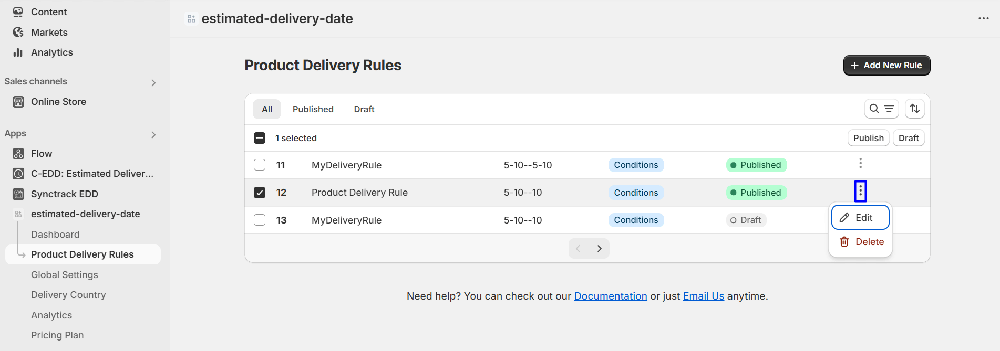
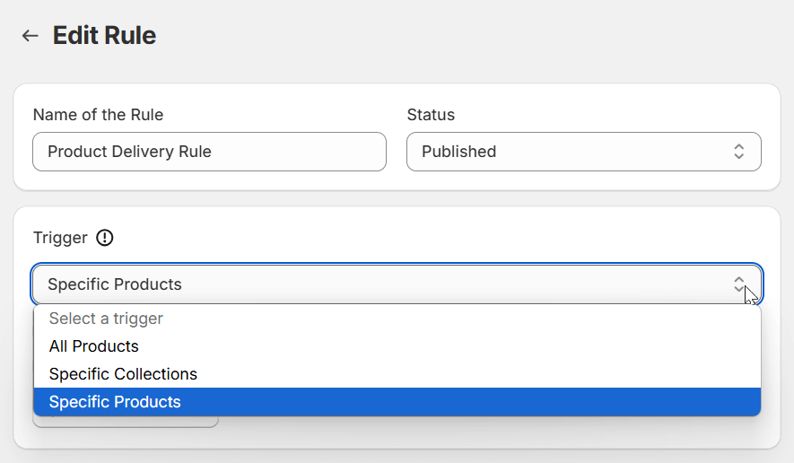
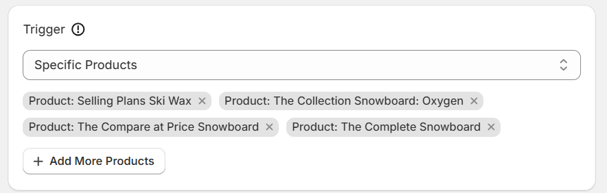
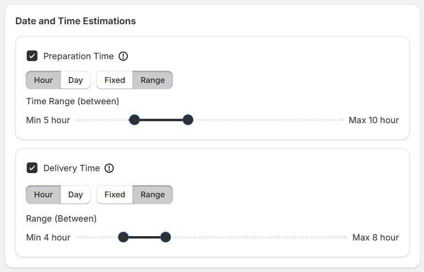
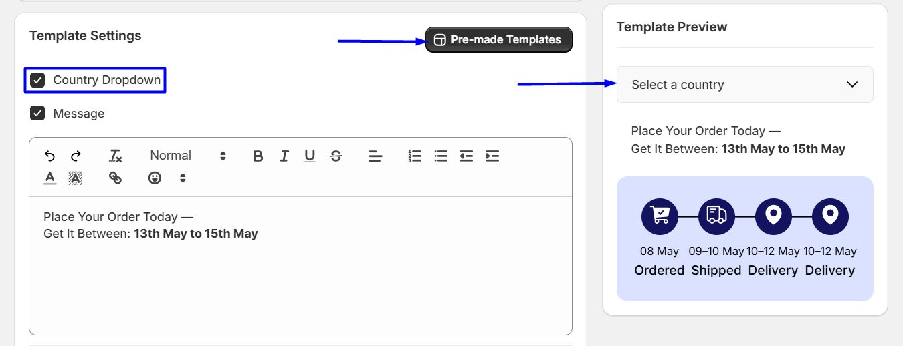
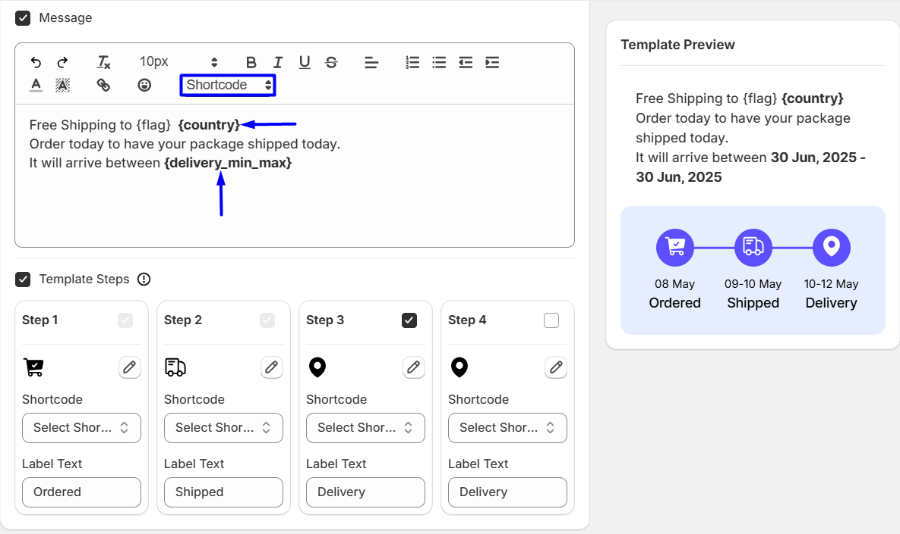
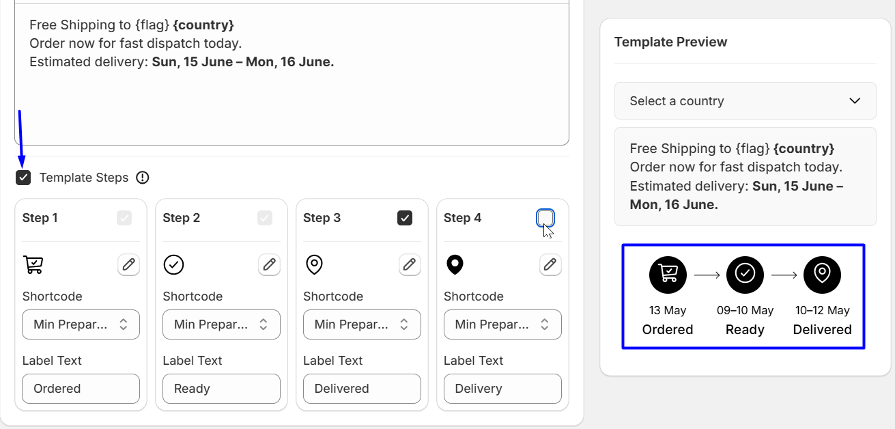
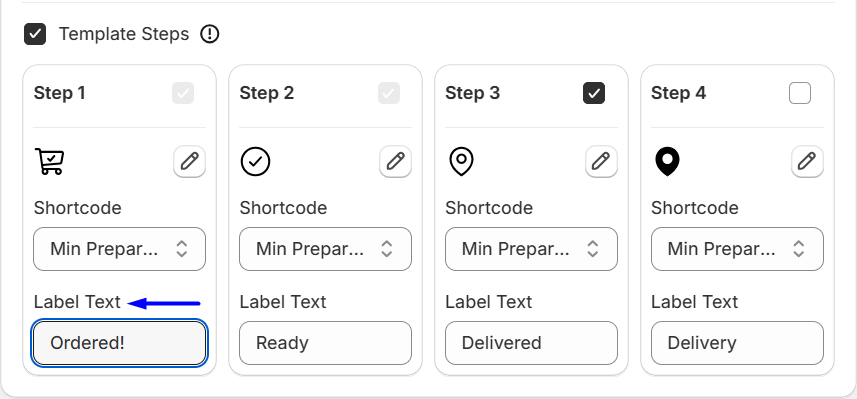
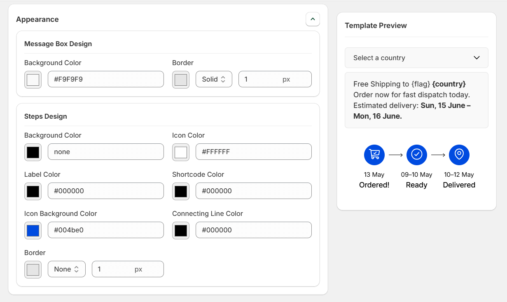

# ETA Rule / Delivery Rule

Before you start playing with the parameters, you need to give your rule a name and set the status of that rule.

_By default, all delivery rules are set to ‘draft’. You need to set the ‘Status’ to “Active” - set that, and your rule is published. From the ETA rules dashboard, you can see which rules are in ‘draft’ and which ones are live._

## Product Trigger

_The trigger is the product for which you want to show the Estimated Delivery Date._

There are 3 options here. You can choose to show the delivery date trigger for all products, for a specific collection of products, or only specific products.

_If you choose specific products, you need to select the products for which you wish the Estimated Delivery Date system to trigger._

## Estimated Date and Time

In this section, you’ll be able to set the estimated preparation time and the delivery time ranges.

You can select between fixed and ranged numbers for the prep and delivery times. Using the sliders, you can select the hours or the days your business needs for the preparation and the delivery of the products.

_**Special Note:** The Estimated Preparation Time and Delivery Time are not specific to any country. The prep time and the delivery time without a specific country selection will remain as the ‘original’ preparation and delivery times set from the ‘Estimated Date and Time’ settings._

_For example, if you choose to add delivery ranges in an ‘ETA Rule’ plus_

## Template Settings

_Templates can be easily imported and used directly. See the template_

It’s one of the core settings of the WowETA app. Here, the very first thing you can do is:

1. **Enable/Disable the Country:** Enable/disable the country selector for the country-based shipping.
2. **Enable/Disable ETA Message Bar:** Enable/Disable the delivery message.

If the ETA message bar is enabled, you can share a custom delivery message or use the built-in shortcodes from the editor. Simply select the shortcode and embed it into your message.

_However, before you share a message, it’s better to use one of the pre-made templates to show the estimated delivery time. The delivery messaging system is directly connected to these messages._

Moreover, you can control how many steps you want to show (2 steps are set by default).

You can set up the messages for the templates using the message bar - you can use your messages and a combination of the shortcodes to make it happen.

### Notes on Shortcodes:

- **`{today}`** - Shows the current delivery time.
- **`{prep_min}`** - The minimum preparation time
- **`{prep_max}`** - The maximum preparation time
- **`{prep_min_max}`** - The range starting from the minimum preparation time to the maximum preparation time.
- **`{delivery_min}`** - The minimum delivery time
- **`{delivery_max}`** - The maximum delivery time
- **`{delivery_min_max}`** - The range starting from the minimum delivery time to the maximum delivery time.
- **`{flag}`** - shows the country flag
- **`{country}`** - shows the plugin name

## ETA Template Steps

These are the steps you can show - in general, using one of the pre-made templates will save you time.

_You can enable/disable the ETA template steps if you want._

In the ETA steps, for each individual step, you can select:

The icon for the step - you can choose from the library of icons.
The shortcode - you can choose one of the shortcodes from the pre-defined list.

Label - add a label text.

_Please note one thing - by default, the “None” shortcode is selected. If the preparation and delivery times are not set up, the country-specific delivery time will show._

Furthermore, the appearance can be changed directly from the appearance settings below. You can change the message design.

You can also change the appearance of the steps.
