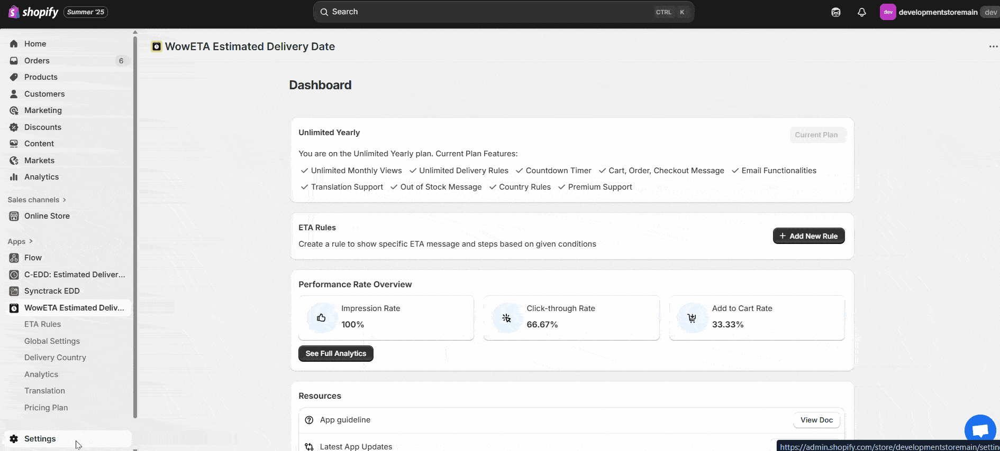
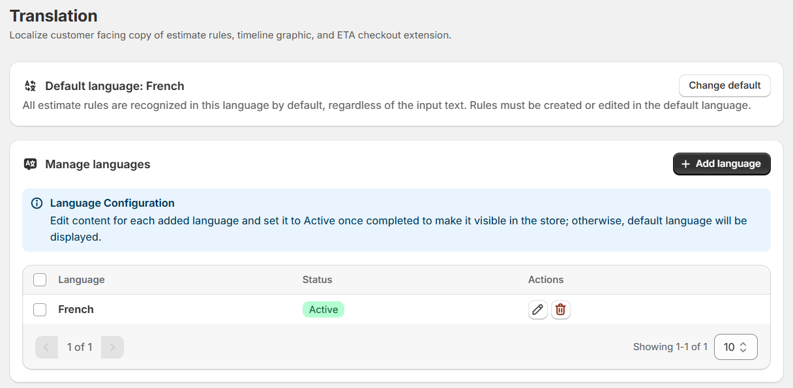
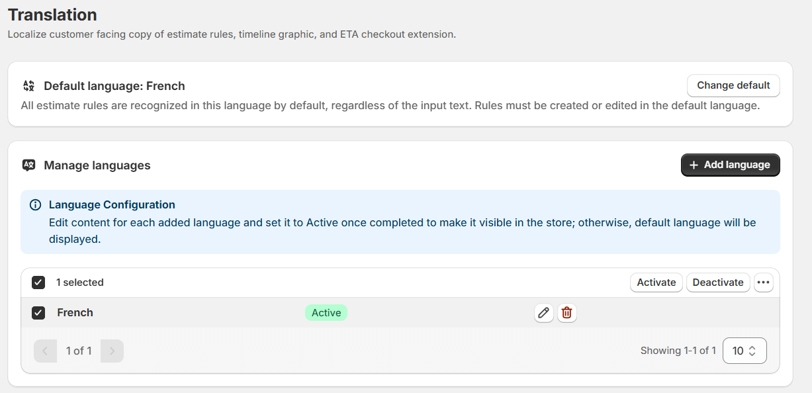
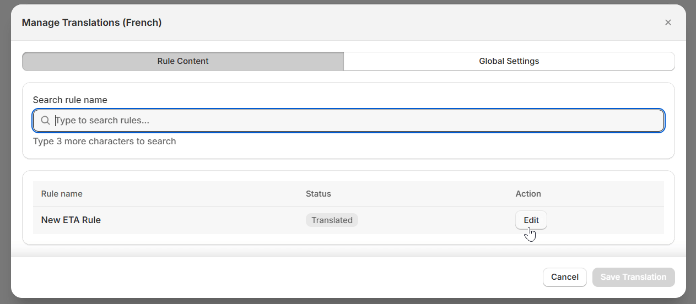
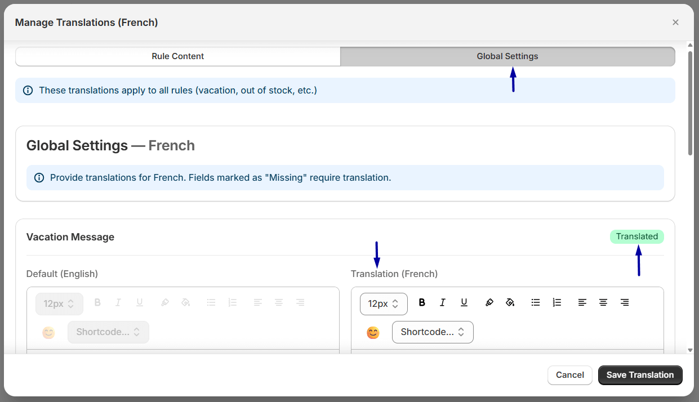
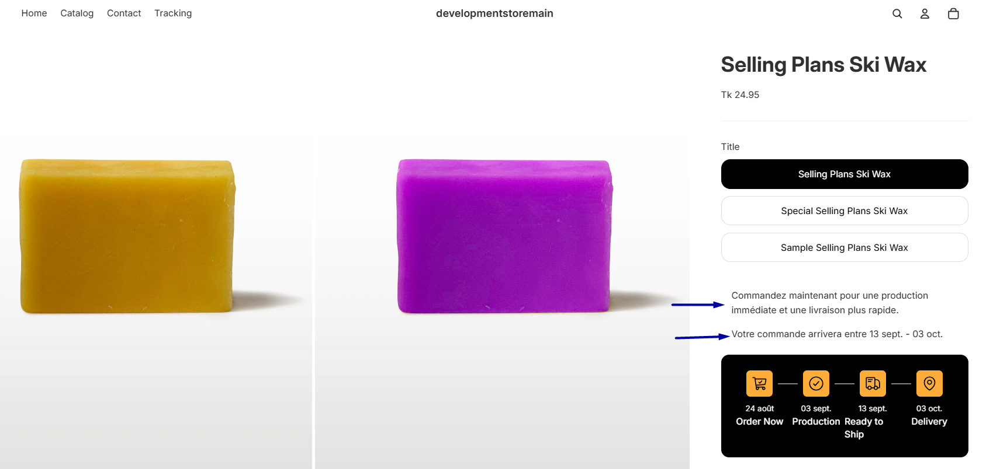

# Translation

Disclaimer: Please note that you need to add the language from your Shopify language settings before you proceed. To do this:

1. Go to your Shopify dashboard and click on Settings
2. Then select ‘Languages’
3. Add the language of your choice
4. Connect the domain
5. Click on Done

_Please note that you don’t need to add any translations here. You’ll have to add it in the WowETA translation settings._

From the translation settings, you can change the default language settings. You can show any language as the default. Furthermore, you can manage the translation settings as well.

Based on your needs, you can make changes to the language of specific rules.

_Please note that you need to provide a translation for the specific rule you want to show in French._

But if you wanted to show a different language globally, you need to offer translations for each of the sections individually.

_Note that the change in the language will show up using a specific region-based shortcode. For example, if a French user were to observe the site, he or she would see the link as: shop.myshopify.com/fr/products/ (this is just a dummy link - how the user will see the link)._

Here’s how it looks on the front-end.

