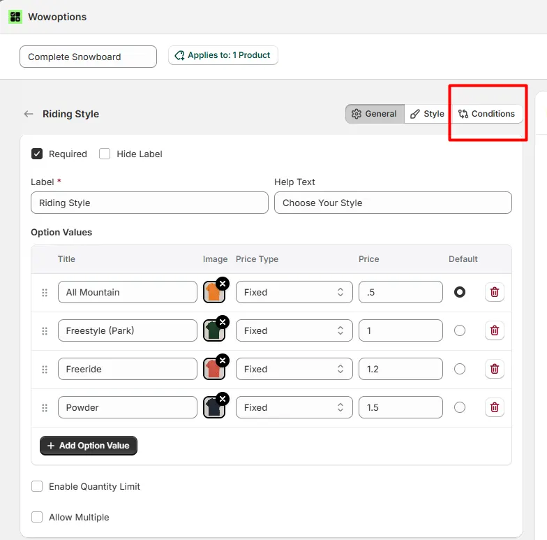
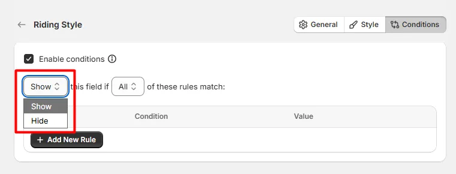
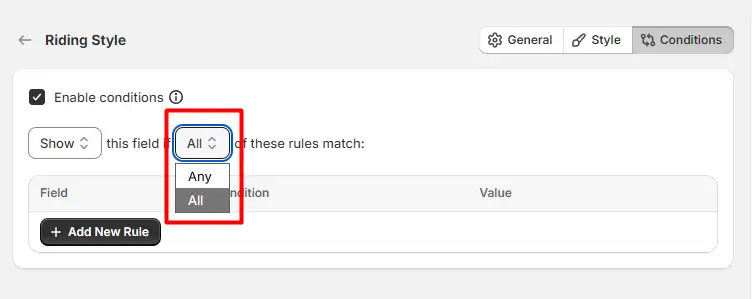
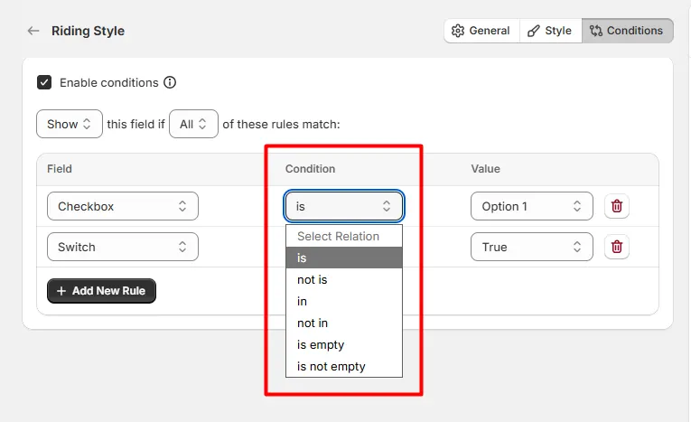

# Conditional Logic

Conditions allow you to control when an option field is shown or hidden based on selections made in other fields. This helps create dynamic product forms where customers only see options that are relevant to their choices.

## Enable Conditions

Enable this option to apply conditional rules to the field. Once enabled, the field will follow the rules you define.

## Visibility

Defines what happens when the conditions are met.

* **Show**: The option will appear only when the defined conditions are satisfied.
* **Hide**: The option will be hidden when the defined conditions are satisfied.

## Match Type

Controls how multiple rules are evaluated.

* **Any**: The condition will be applied if any one of the rules is true.
* **All**: The condition will be applied only if all rules are true.

 This creates four possible rule combinations:

| Visibility | Match Type | Behavior                                     |
| ---------- | ---------- | -------------------------------------------- |
| Show       | Any        | The field appears if any rule matches.       |
| Show       | All        | The field appears only if all rules match.   |
| Hide       | Any        | The field is hidden if any rule matches.     |
| Hide       | All        | The field is hidden only if all rules match. |

## Rules

Rules determine which field and value will trigger the condition. Each rule contains the following:

* **Field**: Select the field whose value will be checked.
* **Condition**: Defines the relationship between the selected field and the value. Common options include:
  * is
  * Not is
  * is Empty
  * is Not Empty
  * Contains
  * Not Contains
* **Value**: The value that will be compared with the selected field.

Click Add New Rule to add additional conditions. Multiple rules can be combined to create more advanced logic.

## Important Note

⚠️ Conditions should be added to the options you want to show or hide, not on the option field that triggers the condition.

In other words, apply the condition to the target option field whose visibility should change.

## Example

If you want to show a Text Field when "Gift Wrap" is selected, add the condition to the Text Field, not the Gift Wrap field.

If you want to hide an Upload field unless "Custom Design" is selected, configure the condition on the Upload field.

This ensures the selected field will appear or disappear based on the values of other fields.
