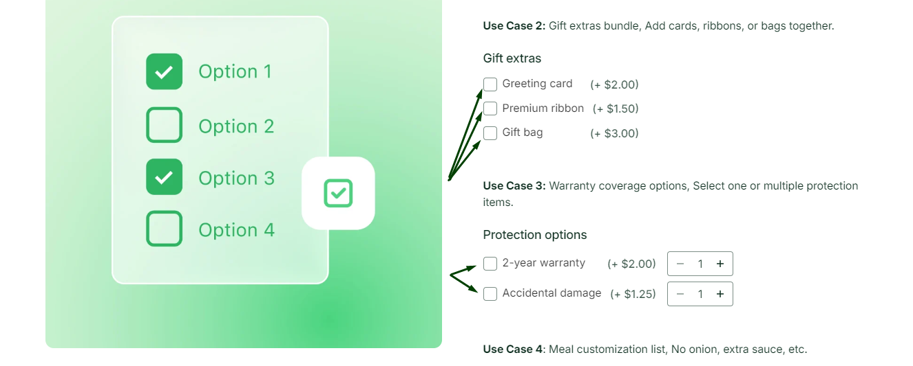

# Quantity Selector

Quantity Selector in WowOptions lets Shopify merchants add quantity controls to individual option values. Instead of allowing customers to select only one option value, merchants can let shoppers choose how many of each option they want directly from the product page.

This is useful for stores that sell customizable bundles, add-ons, toppings, flavors, accessories, parts, gift items, or mix-and-match products.

## When and Why You Should Use Quantity Selector

Use Quantity Selector when customers need to select multiple quantities from the same option group.

It works best for products where customers are not just choosing what they want, but also how many of each item they want.

For example, if a merchant sells a custom snack box, customers may want different quantities of different flavors. Without Quantity Selector, the customer may need to place multiple orders, repeat the same selection, or leave a note manually. With Quantity Selector, they can choose everything clearly from the product page.

**Quantity Selector helps merchants:**

* Sell more add-ons from the product page
* Make bundle-building easier for customers
* Reduce manual order notes and confusion
* Offer a cleaner mix-and-match shopping experience
* Increase average order value through extra selections
* Give customers more control over custom product choices

This feature is especially helpful when each option value can be selected more than once.

## Supported Option Types

Quantity Selector works best with option types where customers select from predefined values.

You can use Quantity Selector with:

* Checkbox
* Radio
* Dropdown
* Button
* Color Swatch
* Image Swatch
* Product Swatch

Before publishing, check the option field settings in your WowOptions dashboard to confirm that Quantity Selector is available for the option type you are using.

## How to setup with real use case

Imagine, Max is running a cup cake store and his customers want to buy his most popular Dozen Cup Cake Box. But they have their preference and they want to choose their own flavours with their chosen numbers in quantity.

For example, one of Max's customers wants to order a Dozen Cup Cake Box from his online store but among his 9 flavours he loves Tiramisu and Strawberry Lane flavours more. So he wants to order them multiple in numbers and the rest of them he wants to order only 1.

 Like below:

Here with the help of WowOption’s quantity selector Max’s customer can easily choose the numbers of the flavours that he wants. It’s super easy to understand and order. Let’s see how Max can set it up on his store using WowOptions.

### Step 1

- At first you need to create a new option set from the option types that supports the feature - QUANTITY SELECTOR. For here in this case, we are using image swatches to showcase flavours of the cup cakes and the feature.
- Add all the flavour names and images that you have and want to show to your customer.

### Step 2

Now, scroll a bit down and you will see the main options of selecting the quantities.

- At the first, you’ll have a default option of minimum selection and maximum selection. Here it means the number of options or items that your customer can choose. In this case, one customer can choose a maximum 9 flavours of cup cakes.

- Second, enable the option: “Let shoppers set a quantity for each option”. Here, it means the exact same thing - your customer can select the minimum and maximum number of quantities for each individual item. For this case, set the quantity for each flavor that one can pick maximum or minimum.

- Third, enable the option: “Limit the combined total”. Here, it means how many total items one can select or have in all the items with all the variations, here in this case if they choose a dozen box of cup cake then they can select maximum 12 cup cakes.

Like the screenshot below:

### Step 3

At last do not forget to add the option set to your products and save it to see it on your store front successfully.

This is how you can successfully add the quantity selector options to your product and help your customer to add their own chosen options that they want to like & You can charge them as per quantity. This is how it works.

## Need Help with Setup?

If you need help setting up Quantity Selector, the WowOptions support team can assist you through the in-app live chat. You can contact support if the quantity controls are not showing properly, if the selected quantities are not appearing as expected, or if you need help applying the feature to a specific product setup.

WowOptions also provides live chat and support options for merchants, including priority and VIP support on higher plans.
