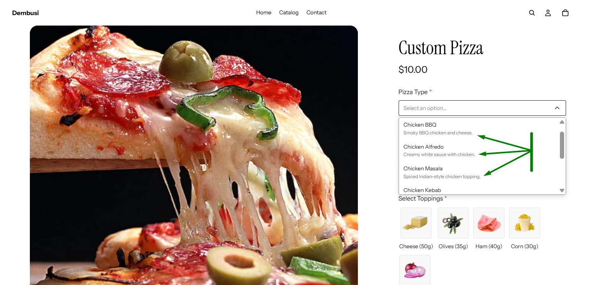
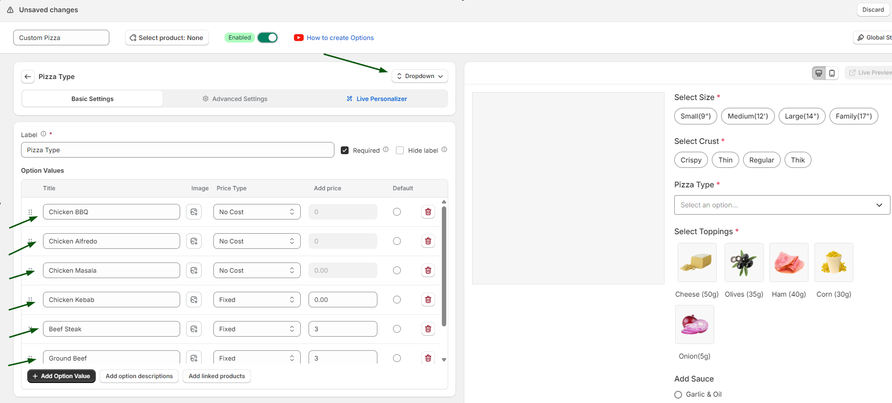
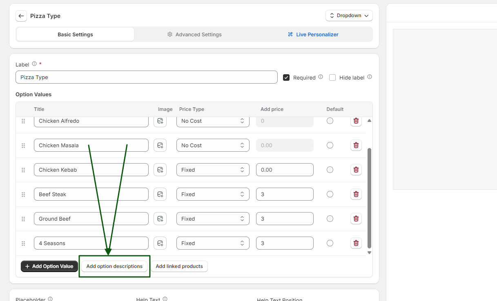
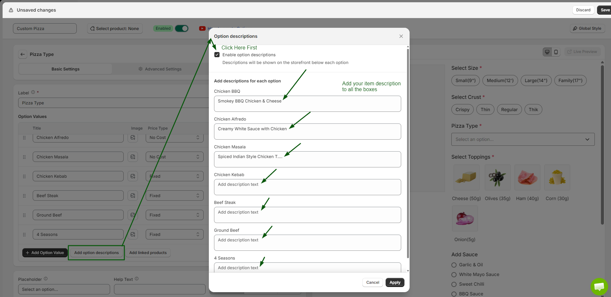
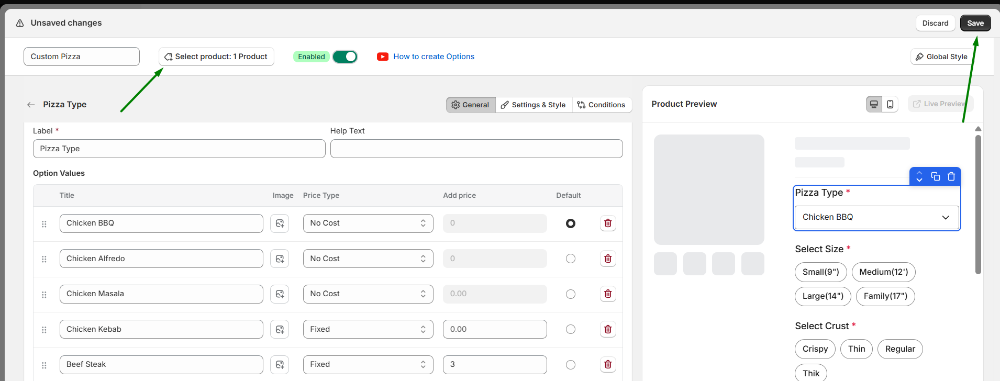

# Add Option Value Description

Option Value Description in WowOptions helps Shopify merchants add extra details to individual option values. Instead of showing only the option name, merchants can explain what each choice means, what it includes, or why customers may want to select it.

This feature is useful when product options need a little more context. For example, if a merchant offers Standard Packaging, Gift Wrap, and Premium Box, each value can include a short description so customers understand the difference before choosing.

## When and Why You Should Use Option Value Description

Use Option Value Description when customers may need more information before selecting an option value.

Some product choices are not always clear from the option name alone. A short description can explain the benefit, material, size, package content, service details or difference between similar choices.

Option Value Description helps merchants:

* Explain each option value more clearly
* Reduce confusion during product customization
* Help customers compare choices faster
* Highlight premium or paid options
* Make product pages more informative without long paragraphs
* Reduce pre-purchase questions
* Create a cleaner and more guided shopping experience

This feature is especially useful for customizable, premium, gift-based, service-based, or visual products where each option value needs a quick explanation.

## Supported Option Types

You can use Option Value Description to show supporting information in different ways depending on the option layout.

Supported description placements include:

* Description Below Each Options
* Description Inside Tooltip
* Description Below Image
* Description Option Name
* Description Below Colors
* Description for Checkbox Items

These placements are useful for option types such as dropdowns, checkboxes, radio options, color swatches, image swatches, and other visual/custom option fields available in WowOptions. The WowOptions documentation includes option types such as Checkbox, Color Swatch, Dropdown, Image Swatch, Product Swatch, Radio, Button and more.

## How to setup with real use case

Imagine, Max is running a Pizza shop online and his customers love to choose their burgers with their own choices like crust, toppings, sauces, meat types etc.

For example, one of Max's customers wants to order a Pizza. The very first thing he needs to choose is the Pizza types. Now, you have shown the pizza type in a drop down but your customer wants to know a bit more details about the pizza type or about its ingredients. To showcase that without changing the structure of the product page Max can use the value description option to each pizza type.

Like Below:

Here with the help of WowOption’s Option Value Description Max’s customer can easily see the details of each pizza type and decide what to select. It’s super easy to understand and order. Let’s see how Max can set it up on his store using WowOptions.

### Step 1

- At first you need to create an option set with all the variations or options that you want your customers to select for ordering the pizza.
- For showcasing pizza types you can add and select the dropdown options.
- Add the types of the pizza: add all the flavours name.

### Step 2

Below the option field,  you will see 3 buttons and one of them is **Add Option Descriptions**. Click on that.

Then you will see a window of adding the option descriptions, at first click on the enable option description feature & add your option details to each value. And after adding all the descriptions click on the apply button.

### Step 3

At last, do not forget to add this option set to your products and save it to check the final result.

## Need Help with Setup?

If you need help setting up Option Value Description, the WowOptions support team can assist you through the in-app live chat.

You can contact support if descriptions are not showing correctly, if you are unsure which description placement to use, or if you want help applying descriptions to specific option types such as color swatches, image swatches, dropdowns, radio buttons, or checkbox items.

This is especially helpful when your product has many option values and you want to keep the product page clean, clear, and easy for customers to understand.
