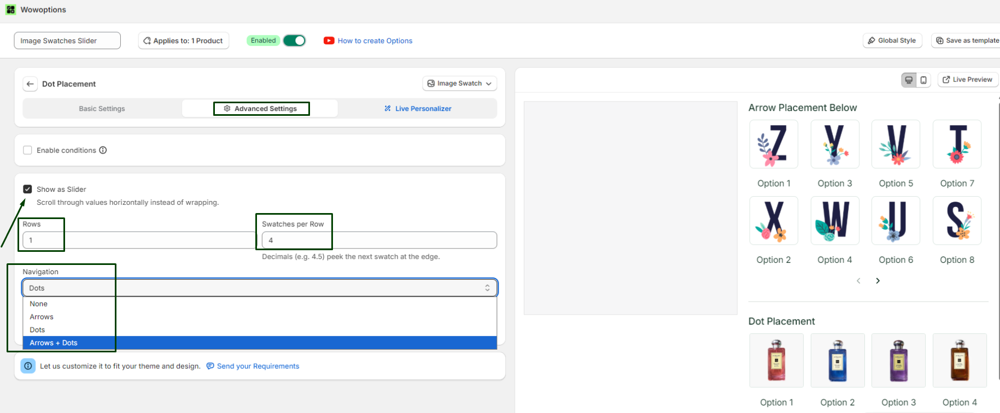
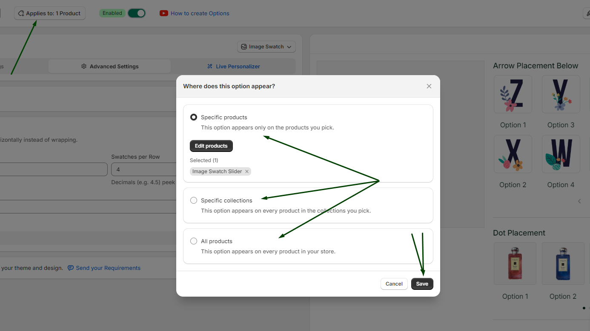

# Image Swatch Slider

Image Swatch Slider in WowOptions helps Shopify merchants display multiple image-based option values in a cleaner, scrollable layout. Instead of showing a long list of image swatches on the product page, merchants can organize them inside a slider so customers can browse visual choices more easily.

This feature is useful when a product has many design, pattern, style, texture, or visual variation options. WowOptions supports flexible product option types such as swatches, dropdowns, checkboxes, text fields, file uploads, buttons, sliders, and more, making it useful for visual product customization.

## When and Why You Should Use Image Swatch Slider

Use Image Swatch Slider when your product has many visual option values and customers need to compare them before choosing.

Image Swatch Slider helps merchants:

* Keep product pages clean and organized
* Display more image options without taking too much space
* Make visual option browsing easier for customers
* Improve the shopping experience on mobile devices
* Reduce visual clutter on customizable product pages
* Help customers compare designs, patterns, textures, or styles faster
* Create a more polished product customization layout

This feature is especially useful for print-on-demand stores, fashion stores, gift shops, home decor brands, handmade product stores, stationery stores, bakery stores, and any Shopify store that sells visual or customizable products.

## How to setup with real use case

Suppose Max sells perfume in his store. But, the number of perfumes are too many but he wants to showcase it in one section inside the product page. Now, he can easily do that using WowOptions. Like below:

### Step 1

You can also easily do that, First add option type “Image Swatches” to your option set.

Then add your product/item details, like name, images, price etc. to the option.

Then click on the advanced setting button.

### Step 2

- At the advanced settings page you will see an option “Show as Slider”. Enable it.
- Add the numbers of rows and number of products/items that you want to add.
- Then select the design or navigation style of the slider by simply selecting the type of the navigation. Like below:

### Step 3

Do not forget to add this option to any specific or all products and to save it.

## Need Help with Setup?

If you need help setting up an Image Swatch Slider, the WowOptions support team can assist you through the in-app live chat.

You can contact support if the image slider is not displaying correctly, if the swatches are not aligned properly, or if you need help applying the slider layout to a specific product option set. WowOptions documentation also points merchants to the in-app chat and support email for configuration help.
