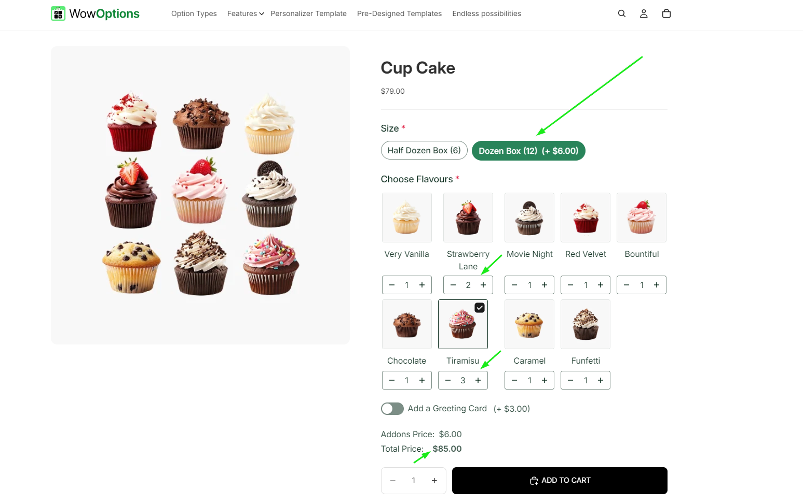

# Color Swatch Slider

Color Swatch Slider in WowOptions helps Shopify merchants display many color choices in a clean, scrollable layout. Instead of showing a long row or large block of color swatches on the product page, merchants can place them inside a slider so customers can browse colors more comfortably.

This feature is useful when a product has many color options, shades, finishes, or visual variations. WowOptions supports flexible option styling and layout control, and its documentation also includes Color Swatch as one of the available option types.

## When and Why You Should Use Color Swatch Slider

Use Color Swatch Slider when your product has many predefined color choices and you want to keep the product page clean.

Color swatches are helpful because customers can see the color before selecting it. But when too many swatches appear at once, the option section can take up too much space, especially on mobile. Color Swatch Slider keeps the color selection area compact while still allowing customers to explore all available options. Color Swatch Slider helps merchants:

* Show more color choices in less space
* Keep product pages clean and organized
* Make color browsing easier for customers
* Improve the shopping experience on mobile devices
* Reduce visual clutter on product pages
* Help customers compare shades, finishes, and color variations faster
* Create a more polished product customization layout

This feature is especially useful for apparel, accessories, phone cases, home decor, cosmetics, candles, drinkware, bakery products, gift items, and any Shopify store that sells products with many color-based choices.

## How to setup with real use case

Suppose Max sells bed sheets in his store, but there are numbers of colors available for each bed sheet. He wants to showcase them all but in a minimalist way. Like below:

How you can do it too..

### Step 1

First add option type “Color Swatches” to your option set.

Then add the colors with color names and price to the option if you want.

Then click on the advanced setting button.

### Step 2

- At the advanced settings page you will see an option “Show as Slider”. Enable it.
- Add the numbers of rows and number of colors that you want to add.

### Step 3

-  After that, select the position or the placement of the “Arrow” for the swatches.
-   Also, set the arrow alignment from here.Like below:

### Step 4

After setting it in your way do not forget to add it to your product where you want to show it.
Click on the “Applies to” button, add it to all or any specific product where you want to show it and Save. Like below:

## Need Help with Setup?

If you need help setting up Color Swatch Slider, the WowOptions support team can assist you through the in-app live chat.

You can contact support if the color slider is not displaying correctly, if the swatches are not aligned properly, or if you need help applying the slider layout to a specific option set. WowOptions provides live chat and priority support options across its plans, including live chat and email support on the Free plan and priority/VIP support on paid plans.
