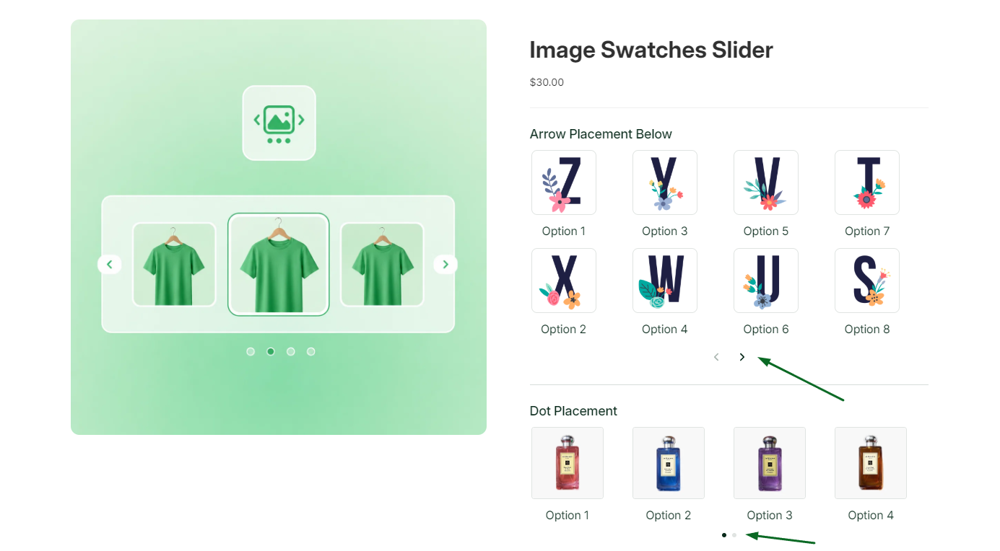
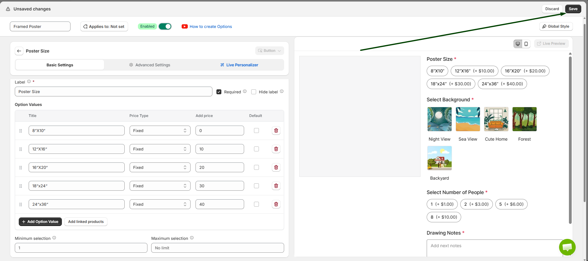
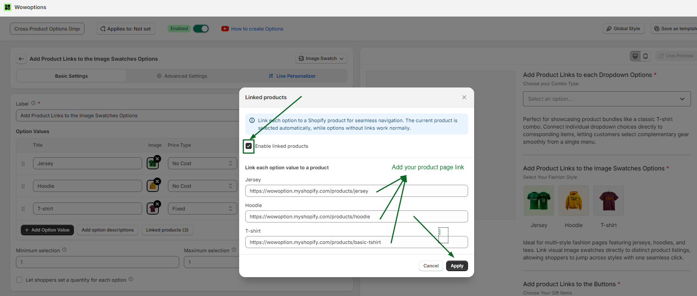
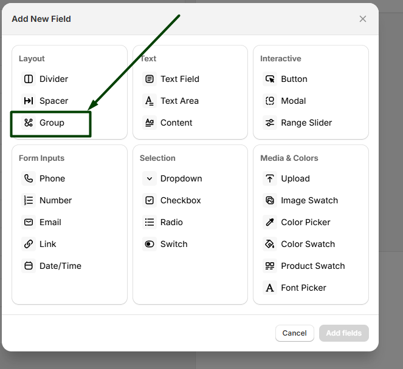
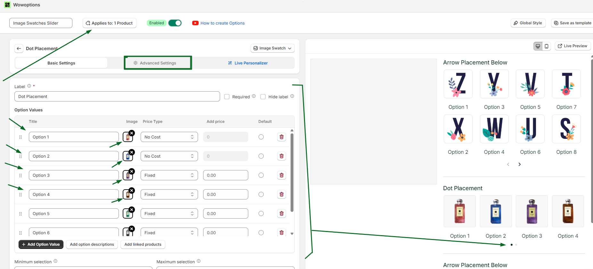

# Collapse

Collapse in WowOptions helps Shopify merchants organize multiple related product option fields inside a clean expandable section. Instead of showing every field at once, merchants can use the **Group** option as a collapsible accordion, so customers can open or close the section when needed.

This feature is useful when a product has several connected options, such as gift options, personalization fields, size and fit details, add-ons, uploads, or delivery instructions. WowOptions’ Group option is designed to collect related product options inside one visual block and can be shown either as a static group or as a collapsible accordion.

## When and Why You Should Use Collapse

Use Collapse when your product page has many option fields and you want to keep the layout clean, structured, and easier for customers to follow.

Some customizable products need multiple fields. But if every option appears at once, the product page can feel long or overwhelming, especially on mobile. Collapse solves this by grouping related fields into an expandable section, so customers can focus on one part of the customization at a time.

Collapse helps merchants:

* Keep long product option forms cleaner
* Organize related fields inside one section
* Reduce visual clutter on the product page
* Make complex customization easier to follow
* Improve mobile product-page usability
* Let customers expand only the section they need
* Create a more guided and professional product option layout

This feature is especially useful for personalized products, gift products, made-to-order items, apparel, furniture, bakery products, print-on-demand products, and any Shopify product that needs multiple related option fields.

## Supported Option Types

The Collapse feature is currently available inside the **Group** function in WowOptions.

Supported placement:

* Group

Inside the Group option, merchants can choose the display style. **Expanded** keeps the group always visible, while **Accordion** makes the group collapsible. When Accordion is selected, merchants can also choose whether the section starts **Open** or **Close** when the product page loads.

## How to setup with real use case

Imagine Max runs an online gift store where customers can personalize their orders before checkout. He offers optional services such as gift wrapping, engraving, shipping protection, and personalized messages.

As more customization options are added, the product page starts to look cluttered and difficult to navigate. Max wants to organize these options into collapsible sections so customers can easily expand only the options they need, creating a cleaner and more user-friendly shopping experience.

Let's see how Max and you can set it up in the Shopify store using WowOptions.

### Step 1

First, create a new option. This option will act as the parent group for your other options.

Enter the Group Name and Help Text according to your requirements.

Like the screenshot below.

### Step 2

Open the Group Settings and change the Group Style to Accordion. You can also choose Group if you prefer a standard grouped layout.

Once you have selected Accordion, click Save to save the group.

See the attached screenshot below.

### Step 3

Now, add the product options that you want to display inside the accordion group.

You can drag and drop existing options under the accordion to organize them into a single collapsible section.

See the attached screenshot below.

### Step 4

After adding all the required options, assign the option set to your product by clicking the Applies To button.

Then, click Save to apply the changes to your store.

See the attached screenshot below.

### Step 5

After completing the setup, go back to the Product Options page and click Save to save the entire option set.

See the attached screenshot below.

### Step 6

Open the product page on your storefront.

You will see the options displayed inside an accordion. Customers can expand or collapse the accordion to view and customize the available options.

See the attached screenshot below.

## Need Help with Setup?

If you need help setting up Collapse inside the Group option, the WowOptions support team can assist you through the in-app live chat.

You can contact support if the group is not collapsing correctly, if the accordion does not open or close as expected, or if you need help organizing multiple child options inside one group.
