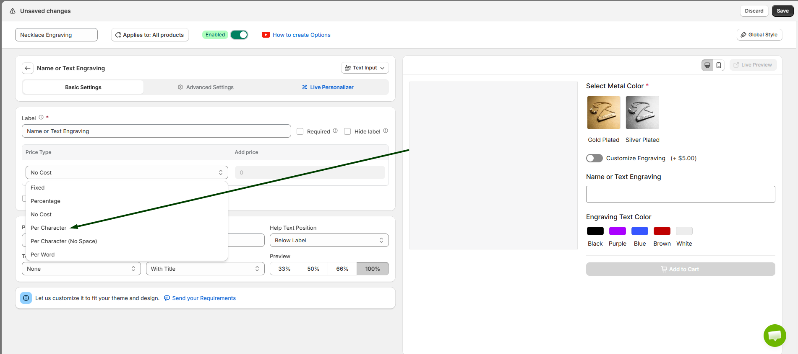
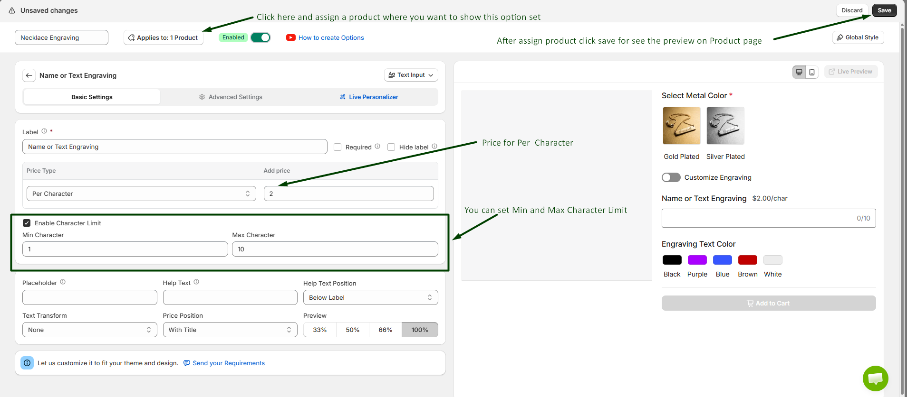
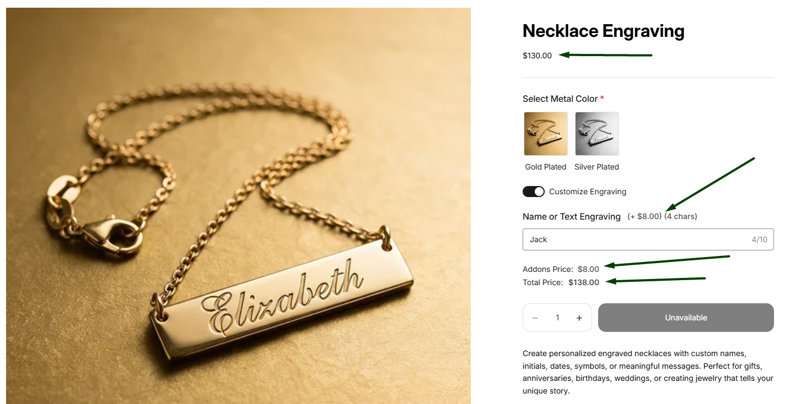

# Character Based Pricing

Character Based Pricing in WowOptions helps Shopify merchants charge customers based on the text they enter on the product page. Instead of using one fixed price for every personalization request, merchants can apply pricing based on the number of characters, characters without spaces, or words entered by the customer.

This feature is useful for personalized products where longer text usually requires more material, production time, design effort, or engraving space.

## When and Why You Should Use Character Based Pricing

Use Character Based Pricing when the cost of customization depends on how much text the customer enters.

Some custom products should not have the same price for short and long text. For example, engraving **“Mia”** on a necklace is not the same as engraving a long custom message on a wallet, plaque, or gift item. Character Based Pricing helps merchants charge more accurately based on the amount of text added by the customer.

Character Based Pricing helps merchants:

* Charge fairly for personalized text
* Avoid underpricing longer customization requests
* Cover extra production, material, or design costs
* Make custom pricing more automatic
* Reduce manual price adjustments after checkout
* Keep pricing clear for customers
* Increase revenue from personalized products

This feature is especially useful for engraving, embroidery, custom printing, name personalization, message cards, plaques, labels, signs, jewelry, gifts, apparel, mugs, phone cases, and made-to-order products.

## Supported Option Types

Character Based Pricing is currently available for text-based option fields in WowOptions.

Supported option types:

* Short Text
* Long Text

For these fields, WowOptions includes pricing options such as **Fixed**, **Percentage**, **Per Character**, **Per Character Without Space**, and **Per Word**, depending on how the merchant wants to calculate the additional cost.

## How to setup with real use case

Imagine Max runs an online personalized gift store. He sells engraved keychains, custom mugs, and wooden plaques that customers can personalize with their own text.

Max wants to charge customers based on the number of characters they enter. For example, if engraving costs $2.00 per character, a customer who enters more characters will automatically pay a higher price. This allows Max to offer flexible pricing while covering the additional engraving cost.

Let's see how Max and you can set it up in the Shopify store using WowOptions.

### Step 1

Max has already created a Text Field option for his product.

To enable Character Based Pricing, open the **“Text Field”** option and click the Price Type dropdown. From the list, select the Per Character option.

Like the screenshot below.

### Step 2

After selecting the Per Character option, enter the price you want to charge for each character.

If you want to limit the number of characters customers can enter, enable the Character Limit option. Then, set the minimum and maximum character limits according to your requirements.

Once you have finished the configuration, assign the option set to your product by clicking the Applies To button. Then, click Save to save the option.

See the attached screenshot below.

### Step 3

Now, open the product page and enter text into the text field.

The product price will automatically update based on the number of characters entered.

For example, Max sets the price to $2.00 per character and enables a minimum character limit of 1 and a maximum character limit of 10. If a customer enters "MAX" (3 characters), an additional $6.00 will be added to the product price. If the customer enters "SHOPIFY" (7 characters), an additional $14.00 will be added automatically.

The customer will not be able to enter more than 10 characters, ensuring the pricing rule and character limit are applied correctly.

See the attached screenshot below.

## Need Help with Setup?

If you need help setting up Character Based Pricing, the WowOptions support team can assist you through the in-app live chat.

You can contact support if the character-based price is not calculated correctly, if you are unsure which pricing type to use, or if you need help applying this feature to Short Text or Long Text fields.
