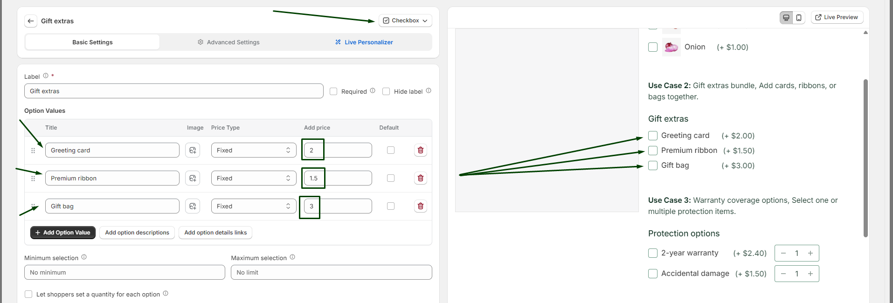
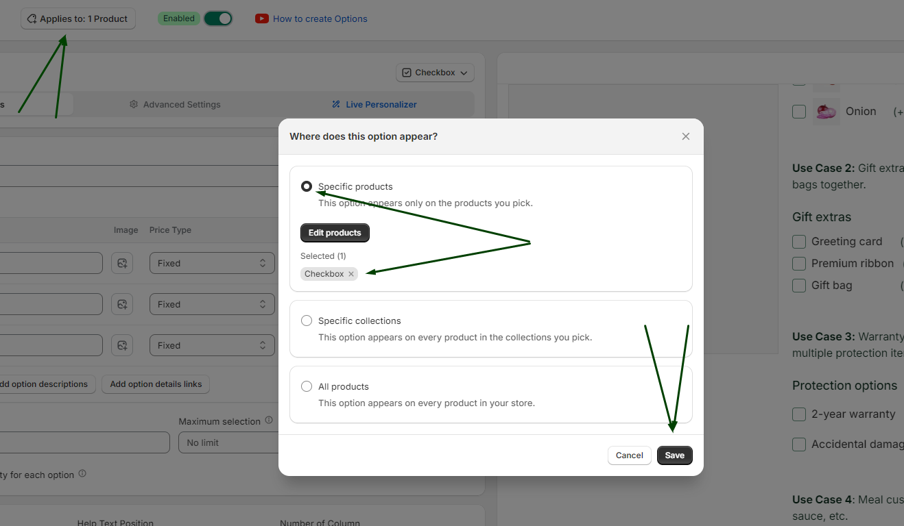

# Addon Products

Addon Products in WowOptions help Shopify merchants offer extra products directly inside the main product option flow. Instead of asking customers to search for related items separately, merchants can display add-on products as selectable choices on the product page.

This feature is useful when you want to recommend accessories, upgrades, frequently bought items, refills, gift items or companion products while the customer is already customizing the main product.

## When and Why You Should Use Addon Products

Use Addon Products when customers may need related products, accessories, or upgrades with the main item they are buying.

Many stores lose extra sales because related products are shown too late, hidden in another collection, or only recommended after the customer has already moved away from the product page. Addon Products solve this by placing relevant product suggestions directly inside the buying flow.

Addon Products help merchants:

* Increase average order value
* Promote related products at the right moment
* Make cross-selling feel natural
* Help customers build a complete order faster
* Reduce the need to search for matching items
* Sell accessories, upgrades, refills, or bundles more clearly
* Create a better product customization experience

This feature is especially useful for electronics, gift boxes, beauty products, fashion accessories, pet products, bakery items, print-on-demand products, furniture, home decor, and product bundles.

## How to setup with real use case

Suppose Max has an online gift store. He sells chocolates, gift items, roses, cards etc. with this main gift items he also wants to sell relevant addons or products like greeting cards, gift box, ribbons etc. etc. Like below:

He can easily do it using different option types, in this case let’s think he is using the checkbox option type to showcase it. You can do it too.

### Step 1

At first, you need to add the checkbox option type to your option set.
Then you need to add the product’s name and the price for each product.
If you want you can add the image too. Like below:

### Step 2

After setting up the add-on products, do not forget to add this feature or option type to your products where you want to showcase it.

- Go to “Applies to” button.
- Select all or specific product where you want to show it.

- Save it.

## Supported Option Types

Addon Products work as a product-based option inside WowOptions. Merchants will use this when they want to show existing Shopify products as selectable add-ons.

## How to setup with real use case

Product Swatch  Supported option type:

Use this option when the add-on is a real Shopify product, not just a text-based choice or simple price add-on.

For example:

* Use Addon Products when customers should select an actual product like a charger, candle, gift card, or care kit.
* Use Add-on Price when customers are paying extra for a service like gift wrap, engraving, rush processing, or premium packaging.
* Use Checkbox when customers only need to select simple non-product choices.

WowOptions product materials mention product swatches and add-on pricing as part of its advanced product option capabilities.

## Need Help with Setup?

If you need help setting up Addon Products, the WowOptions support team can assist you through the in-app live chat.

You can contact support if the add-on products are not showing correctly, if the selected add-on product is not appearing as expected, or if you need help deciding whether to use Addon Products, Add-on Price, Checkbox, or Product Swatch for your setup.
