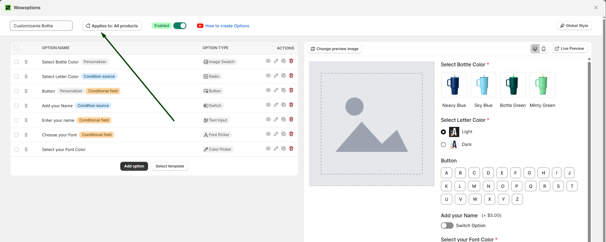
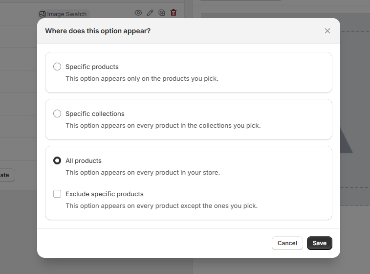
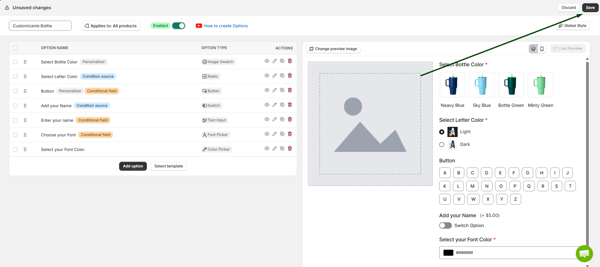
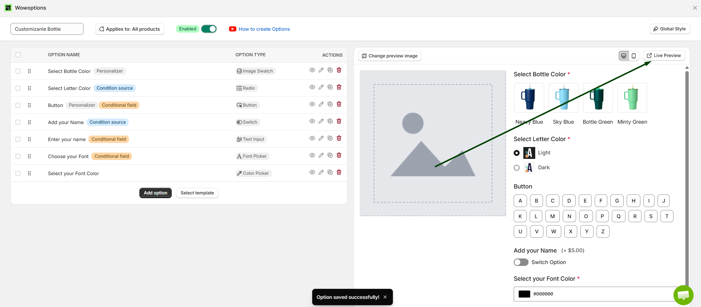

# Live Preview

Live Preview in WowOptions helps Shopify merchants show customers a real-time preview of their product customization. Instead of asking shoppers to imagine how the final product may look, merchants can let them see selected text, colors, images, uploads or design choices updated visually while they customize.

This feature is useful for personalized and visual products where customers need confidence before placing an order. WowOptions is positioned as a no-code product customizer for Shopify stores, supporting custom fields, text fields, image and color swatches, file uploads, price add-ons, conditional logic, product personalization and live preview.

## When and Why You Should Use Live Preview

Use Live Preview when customers need to see how their selected options will affect the final product.

Some customizable products are hard to buy confidently without a preview. If customers are choosing names, initials, logos, uploaded images, print positions, colors, fonts, or designs, they may hesitate because they are not sure how the final result will look. Live Preview helps reduce that uncertainty by showing the customization visually before checkout.

Live Preview helps merchants:

* Build customer confidence before purchase
* Make personalized products easier to understand
* Reduce mistakes in custom orders
* Help shoppers confirm text, color, image, or design choices
* Make the product page more interactive
* Improve the buying experience for visual customization
* Support higher-value personalized products

This feature is especially useful for print-on-demand products, custom T-shirts, mugs, jewelry engraving, phone cases, stickers, posters, business cards, gift items, apparel, and any product where the final design depends on the customer’s input.

## Supported Option Types

Live Preview works best with option types that affect the product’s visual appearance or personalization details.

Recommended option types for Live Preview include:

* Short Text
* Long Text
* Upload
* Image Swatch
* Color Swatch
* Font Picker
* Button
* Radio
* Dropdown

Before publishing, preview the product option setup and check that the selected customer input appears correctly in the live preview area.

## How to setup with real use case

Imagine Max runs an online custom Bottle store. He has already created a new option set with multiple variations, such as text fields, color swatches, image uploads, and font options for his products.

Now, Max wants to use the **Live Preview** feature to check how his custom option set appears on the storefront.

Let's see how Max can set it up in his Shopify store using WowOptions.

### Step 1

Now, Max has already created a new option set for his product with multiple variations.

First, Max needs to assign the option set to the product where he wants to display the custom options. To do that, **click on Applies**.

Like the screenshot below:

### Step 2

When Max clicks on Applies, he will see three options to choose from. He can assign the option set to **Specific Products**, **Specific Collections**, or **All Products**, depending on where he wants to display the custom option set.

See the attached screenshot below.

### Step 3

After assigning the option set to the product, click the **Save button** to save the changes.

Then, go back to the Product Options page and click **Save** to apply the option set to your store.

See the attached screenshot below.

### Step 4

Now, the Live Preview option will become clickable. Click on **Live Preview** to see how your option set appears on the storefront.

After clicking Live Preview, the preview will open in a new tab.

See the attached screenshot below.

## Need Help with Setup?

If you need help setting up Live Preview, the WowOptions support team can assist you through the in-app live chat.

You can contact support if the preview is not updating correctly, if uploaded images or text are not appearing as expected, or if you need help connecting specific option fields to the product preview. WowOptions lists live chat, priority support, VIP support, and setup assistance across its product plans and support materials.
