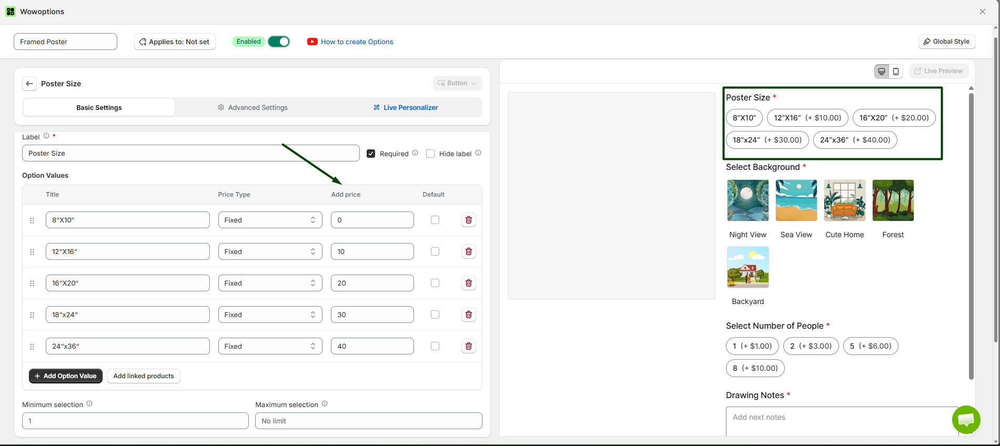
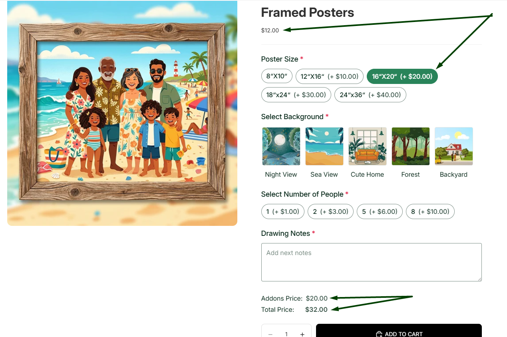

# Add-on Price

Add-on Price in WowOptions helps Shopify merchants add extra charges to product option fields. Instead of creating separate Shopify products or variants for every upgrade, merchants can apply additional pricing directly to the option customers choose.

This feature is useful when a product includes paid customization, premium choices, extra services, special handling or optional upgrades.

## When and Why You Should Use Add-on Price

Use Add-on Price when an option should increase the product price after the customer selects or fills it in.

Some product choices require extra material, labor, design time, packaging, or service cost. Without Add-on Price, merchants may need to manually adjust prices, create too many variants, or lose revenue on premium customization.

For example, if a merchant sells a custom necklace, the base product can stay simple while extra services can be priced separately:

* Standard necklace: no extra cost
* Add engraving: +$6.00
* Premium gift box: +$4.99
* Rush processing: +$9.99

Add-on Price helps merchants:

* Charge extra for premium options
* Increase average order value
* Sell custom services more clearly
* Avoid creating unnecessary Shopify variants
* Keep product pricing transparent
* Cover extra material, labor, or handling costs
* Make paid upgrades easier for customers to understand

This feature is especially useful for personalized products, gift items, apparel, jewelry, print-on-demand products, bakery items, furniture, accessories, service-based products, and stores that sell custom add-ons.

## Supported Option Types

Add-on Price is supported in the following WowOptions option types:

* Phone
* Number
* Email
* Link
* Date & Time
* Short Text
* Long Text
* CheckBox
* Radio
* Switch
* Button
* Range
* Upload
* Image Swatch
* Color Swatch
* Font Picker

These option types can be used when merchants want the customer’s input or selection to add an extra charge to the product price.

WowOptions option settings commonly include price behavior such as no cost, fixed price, or percentage-based pricing, depending on the field type and setup.

## How to setup with real use case

Imagine Max runs an online custom poster store. He allows customers to personalize their posters by selecting different sizes, backgrounds, and other customization options.

Max wants to charge an additional cost when customers choose premium options. For example, selecting a larger poster size should increase the product price automatically. This helps Max cover the extra production cost while letting customers clearly see the additional charges before placing their order.

Let's see how Max and you can set it up in the Shopify store using WowOptions.

### Step 1

Max has already created an option set for his custom poster product.

To add an extra charge, click on the option where you want to apply the additional price. Then, enter the amount in the **Add Price** field.

Like the screenshot below:

### Step 2

Click the Save button to save the option.

See the attached screenshot below.

### Step 3

Now, open the product page on your storefront then you can select the option with the Add-on Price.

You will see that the additional price is automatically added to the product price. For example, selecting the 16" × 20" poster size adds an extra $20.00 to the product price, as shown in the screenshot below.
See the attached screenshot below.

## Need Help with Setup?

If you need help setting up Add-on Price, the WowOptions support team can assist you through the in-app live chat.

You can contact support if the add-on price is not displaying correctly, if the final price is not updating as expected, or if you are unsure which pricing type to use for your product option.

For example, support can help you decide whether to use a fixed add-on price for services like gift wrapping, a percentage-based price for protection plans or a price-added option for premium swatches, uploads and custom text fields.
