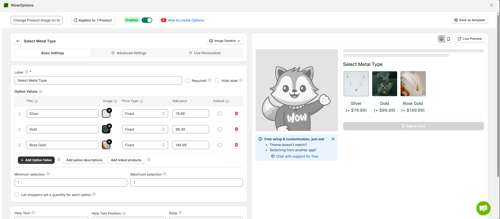
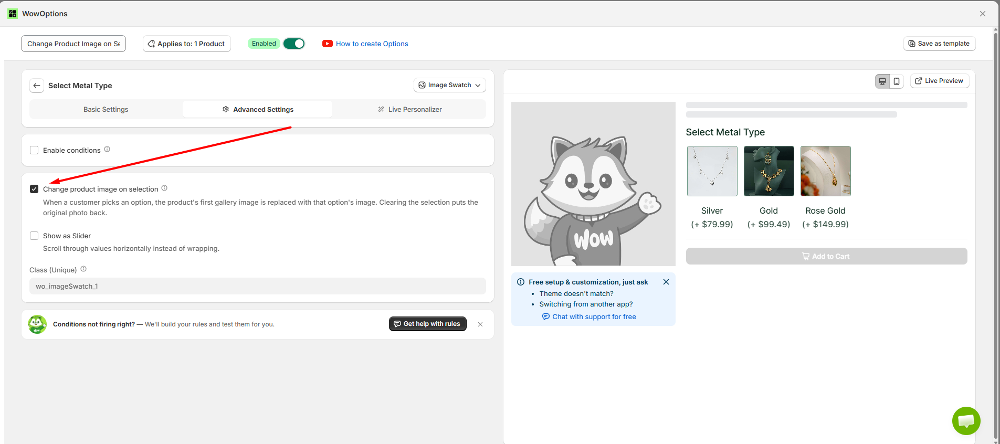
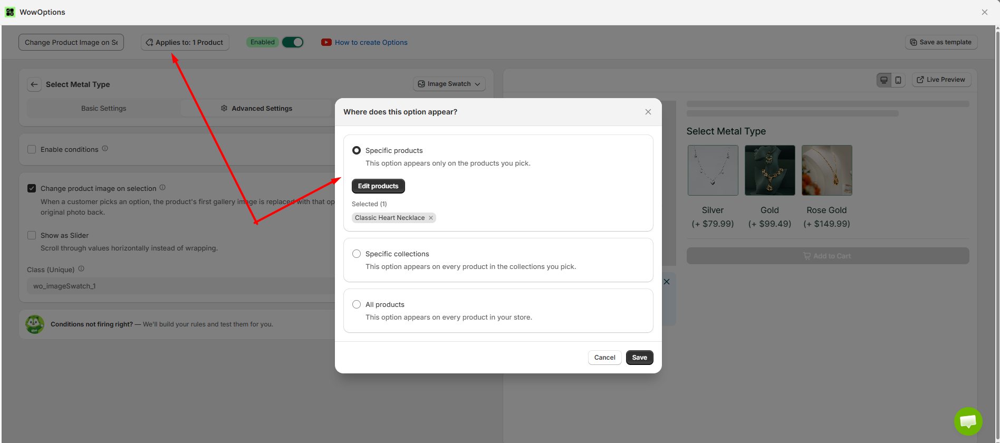
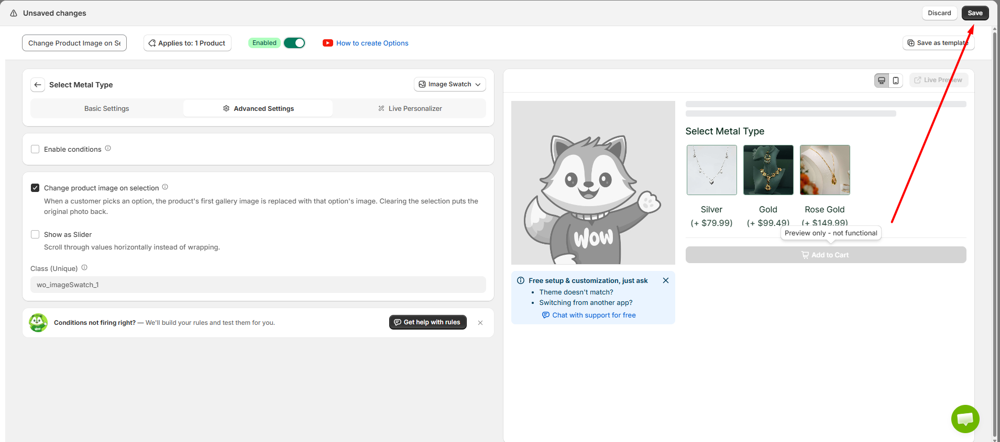
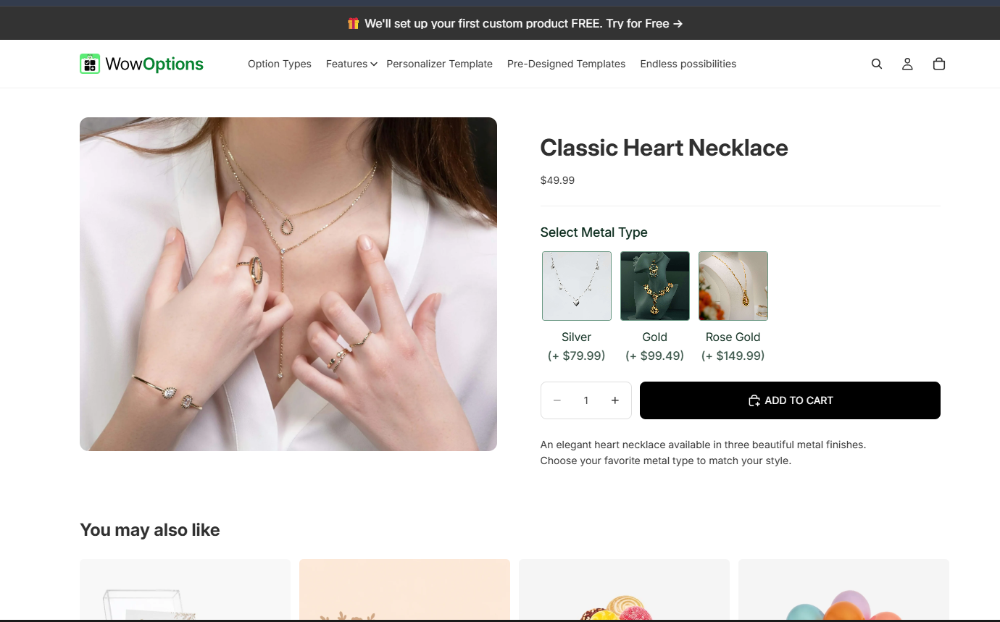

# Change Product Image on Selection

The Change Product Image on Selection feature in WowOptions lets Shopify merchants automatically change the product's main gallery image when a customer selects an option.

Instead of showing the same product image for every choice, merchants can connect images with option values so customers can instantly see how their selected color, material, style, finish, or variation looks.

When this feature is enabled, WowOptions replaces the product's first gallery image with the image connected to the selected option value. If the customer clears the selection, the original product image is restored.

### When and Why You Should Use Change Product Image on Selection

Use Change Product Image on Selection when customers need to visually understand the difference between product choices before placing an order.

For example, a jewelry store may sell the same necklace in Gold, Silver, and Rose Gold. Instead of asking customers to manually browse through multiple product images, the main product image can automatically change when they select a metal type.

This helps customers understand exactly what they are choosing and makes the product page feel more interactive.

Change Product Image on Selection helps merchants:

* Show a visual preview of the selected option
* Make colors, materials, finishes, and styles easier to compare
* Reduce confusion between different product variations
* Improve the product customization experience
* Help customers understand what their selected option looks like
* Make product selection faster and more intuitive
* Create a cleaner and more professional shopping experience

This feature is especially useful for jewelry, apparel, accessories, footwear, furniture, personalized products, print-on-demand items, material choices, color options, finishes, patterns, and other products where the appearance changes based on the customer's selection.

### Supported Option Types

The Change Product Image on Selection feature is available only for the following WowOptions option types:

* Image Swatch
* Dropdown
* Checkbox
* Switch
* Radio

For these supported option types, merchants can assign an image to an option value and enable Change Product Image on selection from the Advanced Settings tab.

When a customer selects an option value, WowOptions replaces the product's first gallery image with the image connected to that value.

If the selection is cleared, the original product image is restored.

For example, you can create a Select Metal Type option with values such as:

* Gold
* Silver
* Rose Gold

Each value can have its own image. When the customer selects a value, the main product image automatically changes to match that selection.

### How to setup with real use case

Imagine Max runs an online jewelry store where he sells customizable necklaces.

One necklace is available in three different metal types: Gold, Silver, and Rose Gold.

Max already has a separate image for each metal type. He wants the main product image to automatically change when a customer selects a metal option.

For example, when a customer selects Gold, Max wants the main product image to show the Gold necklace. When the customer selects Silver, the main image should change to the Silver version.

Let's see how Max and you can set it up in the Shopify store using WowOptions.

#### Step 1

First, create a new option using one of the supported option types:

* Image Swatch
* Dropdown
* Checkbox
* Switch
* Radio

For this example, Max will use the Image Swatch option type.

Enter an option title such as Select Metal Type.

Then, add the option values you want customers to choose from.

For example:

* Gold
* Silver
* Rose Gold

Like the screenshot below.

<figure><figcaption></figcaption></figure>

#### Step 2

Add an image to each option value.

For example:

* Add the Gold necklace image to Gold
* Add the Silver necklace image to Silver
* Add the Rose Gold necklace image to Rose Gold

These images will be used when customers select the corresponding option value on the product page.

After adding the images, save your changes.

See the attached screenshot below.

<figure><figcaption></figcaption></figure>

#### Step 3

Open the Advanced Settings tab of the option.

Find the Change product image on selection setting.

Enable the checkbox.

When this setting is enabled, WowOptions will replace the product's first gallery image with the image assigned to the option selected by the customer.

If the customer clears the selection, the original product image will appear again.

See the attached screenshot below.

<figure><figcaption></figcaption></figure>

#### Step 4

Now, assign the option set to your product by clicking the Applies To button.

Select the product or products where you want to use this option.

After assigning the product, click Save to save the changes.

See the attached screenshot below.

<figure><figcaption></figcaption></figure>

#### Step 5

Go back to the Product Options page and click Save to save the entire option set.

See the attached screenshot below.

<figure><figcaption></figcaption></figure>

#### Step 6

Open the product page on your storefront.

You will see the option you created, such as Select Metal Type.

When a customer selects an option value, the product's first gallery image will automatically change to the image assigned to that value.

For example:

* Selecting Gold displays the Gold product image
* Selecting Silver displays the Silver product image
* Selecting Rose Gold displays the Rose Gold product image

If the customer clears the selection, the original product image will be restored.

<figure><figcaption></figcaption></figure>

Change Product Image on Selection - Step 6

### Important Notes

The feature changes only the first image in the product gallery.

The image shown on selection comes from the image assigned to the selected option value.

If the customer clears the selection, WowOptions restores the original first gallery image.

This feature is available only for Image Swatch, Dropdown, Checkbox, Switch, and Radio option types.

### Need Help with Setup?

If you need help setting up the Change Product Image on Selection feature, the WowOptions support team can assist you through the in-app live chat.

 
