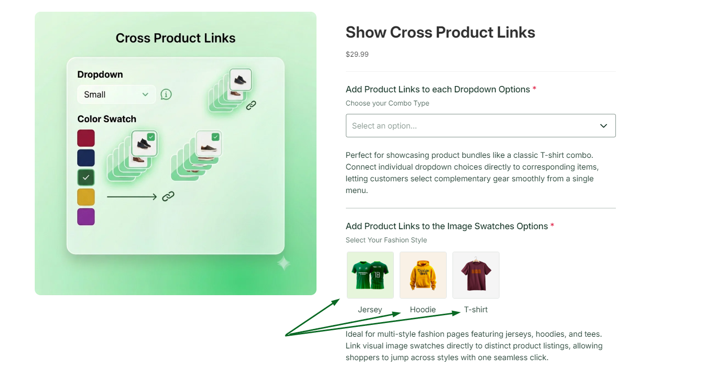
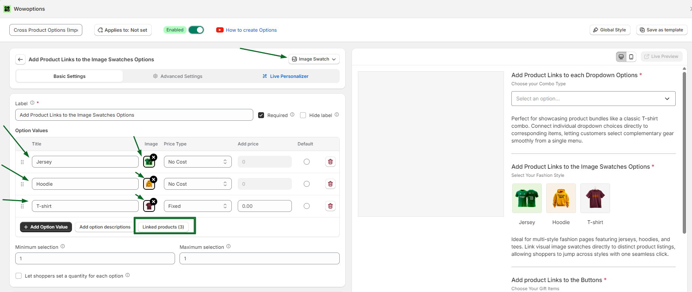
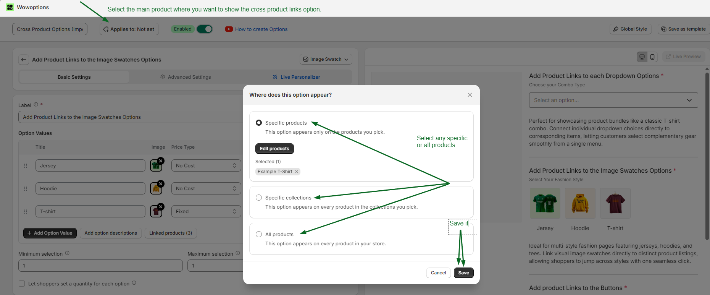
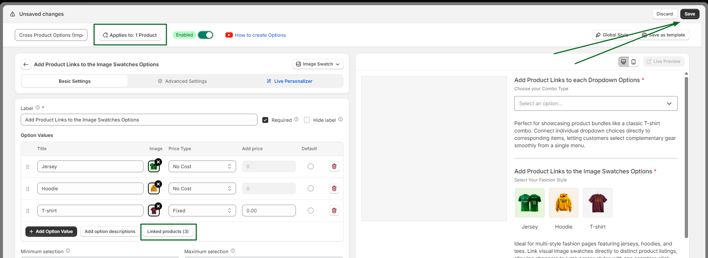

# Cross Product Links

Cross Product Links in WowOptions help Shopify merchants connect option values with other Shopify product pages. Instead of using option values only for selection, merchants can turn them into product navigation links so customers can move between related products more easily.

This is useful when a store keeps colors, styles, materials, models, or design versions as separate Shopify products but still wants customers to browse them from the same option area.

For example, a merchant selling hoodies may have separate product pages for:

* Classic Hoodie
* Oversized Hoodie
* Premium Fleece Hoodie

With Cross Product Links, these related products can appear as clickable option values, helping customers switch between product pages without going back to the collection page.

WowOptions already supports multiple product option types such as dropdowns, buttons, color swatches, image swatches, checkboxes, radio buttons, product swatches, and more, making this feature useful for creating a more connected product browsing experience.

## When and Why You Should Use Cross Product Links

Use Cross Product Links when your related products are created as separate Shopify products, but customers still need an easy way to move between them.

Cross Product Links solve this by letting customers navigate to related product pages directly from the option field.

Cross Product Links help merchants:

* Connect related Shopify product pages
* Improve product discovery
* Make product switching faster for customers
* Reduce unnecessary collection-page navigation
* Help shoppers compare colors, designs, styles, or models
* Create a smoother shopping experience
* Guide customers toward the most relevant product
* Support cross-selling between similar or matching products

This feature is especially useful for stores selling apparel, accessories, shoes, bags, home decor, candles, cosmetics, print-on-demand products, handmade goods, and products with separate pages for each color, style, or design.

## Supported Option Types

You can use Cross Product Links in the option types where customers naturally compare product variations or related items.

For example:

* Use **dropdown product links** when customers need to choose from multiple related product versions.
* Use **image swatch links** when each design, pattern, or style has its own product page.
* Use **button links** when customers need to switch between product models or fits.
* Use **color swatch links** when each product color is managed as a separate Shopify product.

## How to setup with real use case

Suppose Max is running a clothing store and he sells all types of men's clothing like jersey, hoodie, T-Shirt etc. So now, on a specific occasion like, in FIFA Worldcup he wants to showcase these 3 products in one place and wants to place the direct product links in another product (Suppose the product is Football).Like below:

How you can do that:

### Step 1

At first you need to select the option type that supports cross product links feature. For this case, select the option type image swatch. Below the image swatch options you will see 3 buttons and here one of them is linked products.

### Step 2

Now, Click on the “Linked Products” Button. Then, select the “Enable Linked Products”.

It will give you the options to add the product links for each individual product. Add your product links here. And click on the Apply button.

### Step 3

After setting the product links, you need to set it perfectly to the specific product where you want to show it. To do that, just click on the apply button. Select your product and save it. Like below:

And at last, do not forget to save your entire option set to showcase the feature to your store. Just click on the save button. Like below:

## Need Help with Setup?

If you need help setting up Cross Product Links, the WowOptions support team can assist you through the in-app live chat.

You can contact support if your linked option values are not redirecting correctly, if you are unsure which option type to use, or if you need help connecting dropdown values, image swatches, buttons, or color swatches with the right Shopify product pages.
