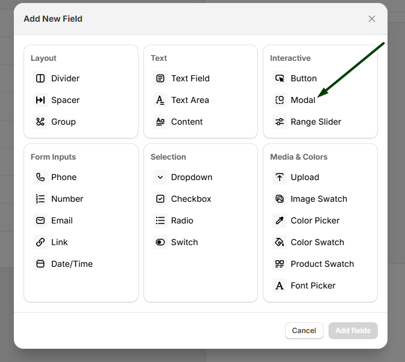
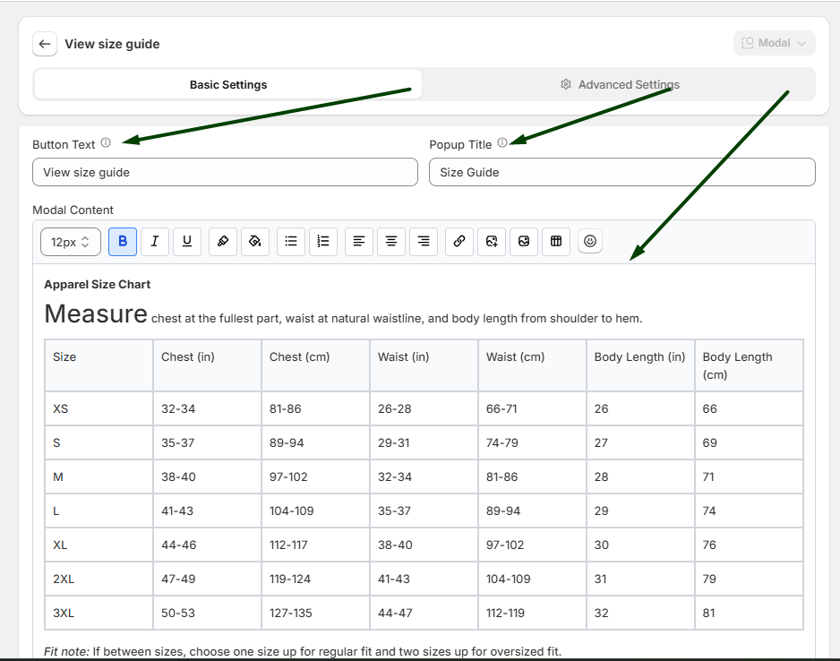
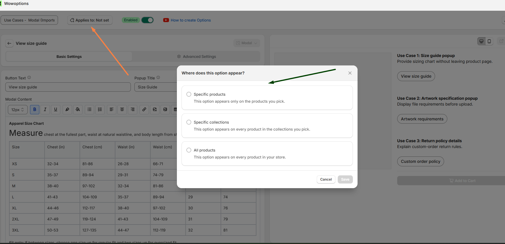
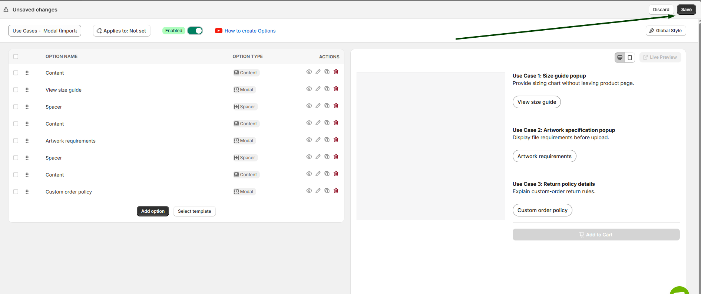
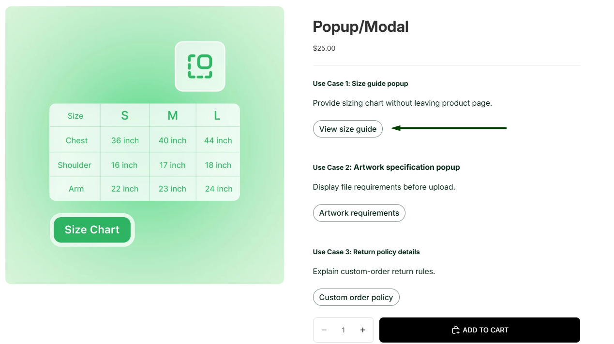
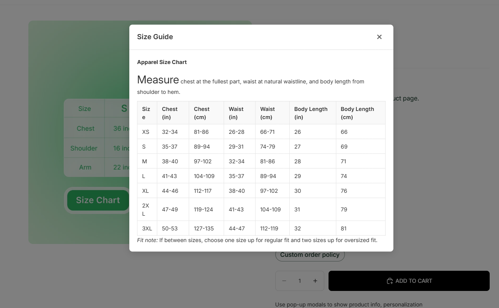

# Pop Up

The Pop Up feature in WowOptions lets Shopify merchants show extra product information inside a clean modal window. Instead of placing every instruction, guide, size chart, or product note directly on the product page, merchants can keep the page simple and display supporting content only when customers need it.

In WowOptions, this feature is available through the Modal option. The Modal option can be used to show additional content such as instructions, size charts, or personalization previews inside a popup window.

## When and Why You Should Use Pop Up

Use Pop Up when customers need extra information, but you do not want to make the product page too long or text-heavy.

Some products need guidance before customers can complete their order. For example, customers may need to check a size chart, understand customization steps, review upload requirements, read care instructions, or learn what is included in a package. A popup keeps that information accessible without distracting customers from the main product options.

Pop Up helps merchants:

* Keep product pages clean and focused
* Show extra details only when customers need them
* Explain setup steps, instructions, or product guidelines
* Add size charts, delivery notes, or return information
* Reduce confusion during product customization
* Improve the buying experience for complex products
* Make product pages feel more organized and professional

This feature is especially useful for personalized products, made-to-order items, apparel, print-on-demand products, digital setup services, gift products, custom packaging, and products that need extra instructions before purchase.

## Supported Option Types

The Pop Up feature is available as one option type in WowOptions:

Modal: The Modal can be shown as a clickable button or link on the product page, depending on how the merchant wants the popup trigger to appear.

Merchants can use the Modal option to display content such as:

* Product instructions
* Size charts
* Customization guidelines
* Delivery or return information
* Additional product details

WowOptions also allows merchants to control the modal content, popup title, trigger label, modal width, field width, style settings, and conditional visibility.

## How to setup with real use case

Imagine Max runs an online clothing store where he sells custom T-shirts, hoodies, and jackets.

Many customers are unsure which size to choose before placing an order. Instead of displaying a large size chart directly on the product page, Max wants to show it in a popup window. This keeps the product page clean while allowing customers to quickly view the size guide whenever they need it.

Let's see how Max and you can set it up in the Shopify store using WowOptions.

### Step 1

First, create a new option and select the Popup/Modal option type.

Like the screenshot below.

### Step 2

After selecting the Popup/Modal option, you will see a few additional settings.

Enter the Button Text that customers will click to open the popup. Then, enter the Popup Title that will be displayed at the top of the modal.

In the Modal Content section, you will find a content editor where you can add any information you want to display inside the popup. For example, you can write product information, create a clothing size chart, add a measurement table, or include care instructions and other helpful content.

Once you have finished, click Save to save the option.

See the attached screenshot below.

### Step 3

Now, assign the option set to your product by clicking the Applies To button.

After assigning the product, click Save to save the changes.

See the attached screenshot below.

### Step 4

Go back to the Product Options page and click Save to save the entire option set.

See the attached screenshot below.

### Step 5

Open the product page on your storefront.

You will see the popup button on the product page. When customers click the button, the popup/modal will open and display the content you added in the editor, such as a size chart, measurement guide, or other product information.

See the attached screenshot below.

## Need Help with Setup?

If you need help setting up the Pop Up / Modal option, the WowOptions support team can assist you through the in-app live chat.

You can contact support if the popup is not displaying correctly, if the button or link is not showing as expected, or if you need help adding content such as setup instructions, size charts, images, links, or product guidance inside the modal.
