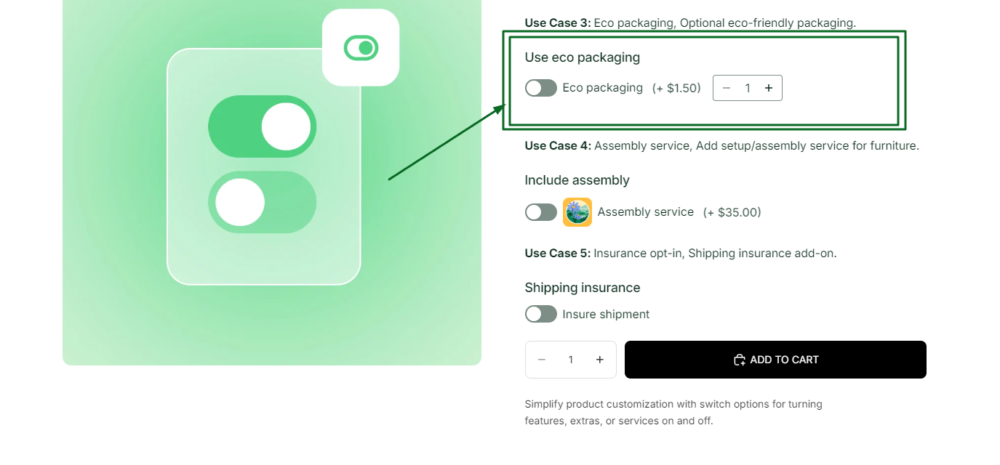
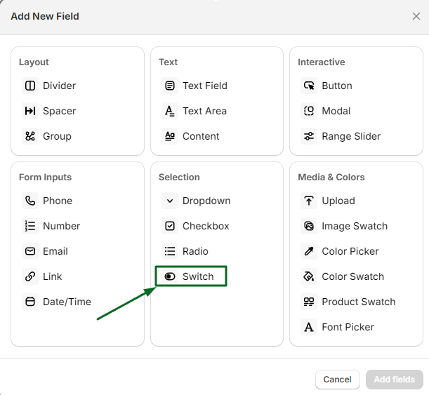
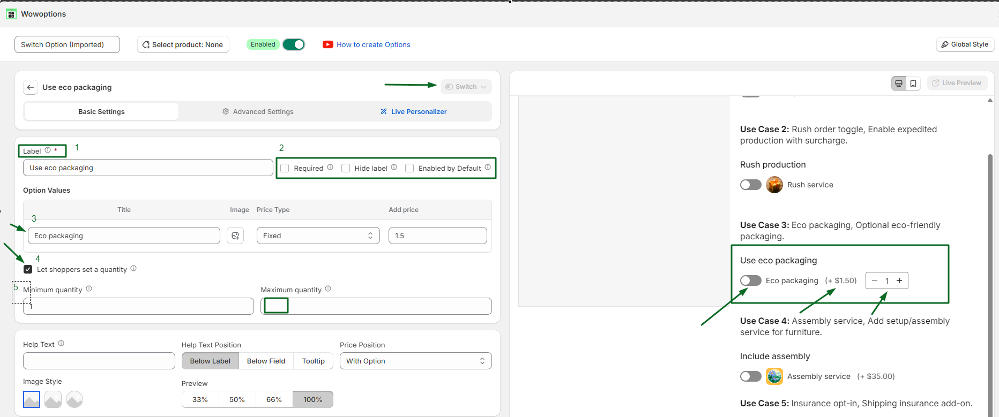
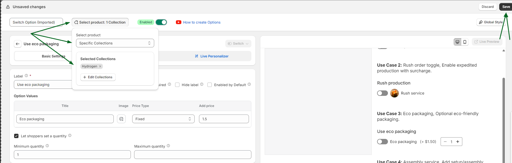

# Switch

Switch in WowOptions lets Shopify merchants add a simple on/off toggle to the product page. It is useful when customers need to enable or disable a single option, such as gift wrapping, express delivery, premium packaging, installation service, or product protection.

Instead of using a dropdown or checkbox for a yes-or-no choice, Switch gives customers a cleaner and faster way to add optional services or upgrades.

## When and Why You Should Use Switch

Use Switch when customers need to make a simple yes-or-no decision on the product page.

This feature works best for optional add-ons, quick upgrades, and extra services that do not need multiple choices. If the customer only needs to turn something on or off, Switch keeps the product page cleaner and easier to use.

For example, if a merchant sells personalized gift boxes, they can use Switch for:

* Add Gift Wrap
* Include Greeting Card
* Add Premium Packaging

Switch helps merchants:

* Offer quick paid add-ons
* Keep product pages clean and minimal
* Make optional services easier to notice
* Reduce unnecessary dropdowns or long option lists
* Improve the customer selection experience
* Increase order value through simple upgrades
* Show or hide related fields with conditional logic

This feature is especially useful for gift stores, jewelry stores, personalized products, bakery items, electronics, home decor, fashion accessories, and service-based product add-ons.

## Supported Option Types

Switch is a standalone WowOptions option type. You can use it when your product needs a simple toggle-based option.

Supported setup options include:

* Switch Option
* Switch with Fixed Price
* Switch with Percentage Price
* Switch with No Cost
* Switch with Quantity Limit
* Switch with Option Image
* Switch with Conditional Logic

WowOptions supports price types such as Fixed, Percentage, and No Cost for the Switch option. Merchants can also control whether the switch is enabled by default and apply quantity limits when needed.

## How to setup with real use case

Suppose, Max has all the options for his product but now he wants to add an optional product that his customer can add echo packaging or they can also skip it if they want. They will be charged extra if they add it to their cart for each piece. Like below:

### Step 1

First, add the option type Switch to your options set. Click on the option type ”Switch”.

### Step 2

Now,

* Add your switch label and make it required if you want. Then you can hide the label & also have the switch option to keep it on by default.
* Then you can add the option value or option name/type. Select the price type like fixed price, price by product percentage, or No cost and set the actual price value.
* Just below the price section you will see a Quantity limit option where you can set how many of them they can add for this extra one.
*

    

### Step 3

After setting up the full SWITCH options, don’t forget to add it to your products and save it. Like below:

## Need Help with Setup?

If you need help setting up the Switch option, the WowOptions support team can assist you through the in-app live chat.

You can contact support if the switch is not displaying correctly, if the price is not updating as expected, or if you need help using Switch with conditional logic.
