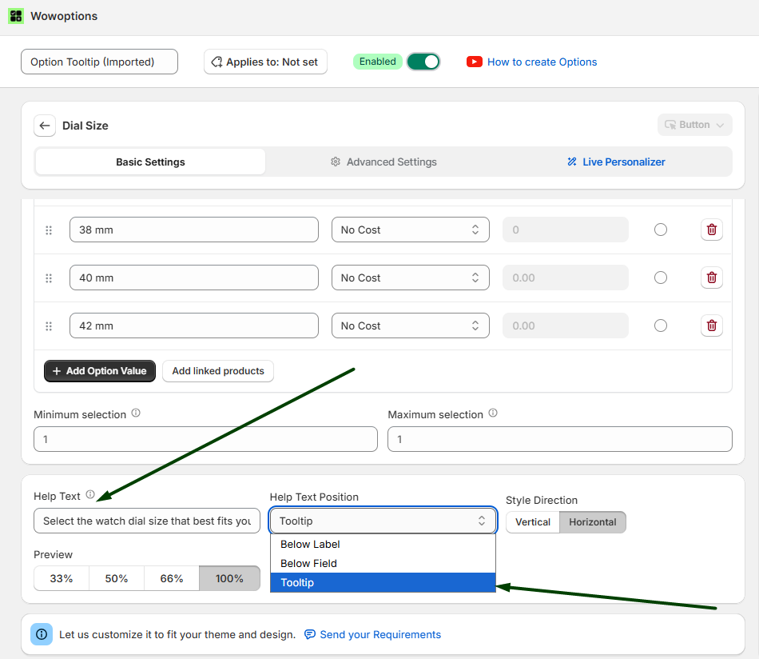
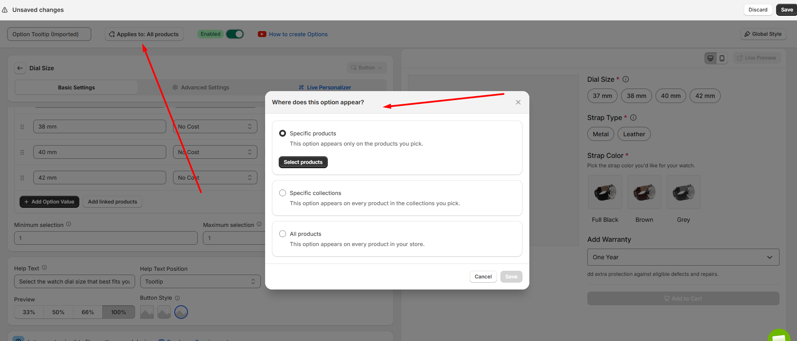
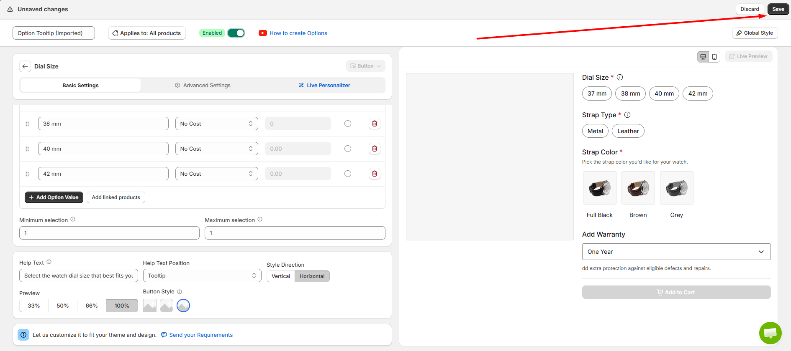
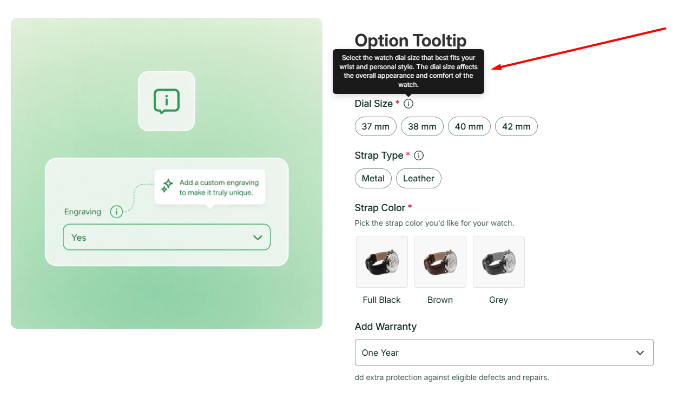

# Tooltip

Tooltip in WowOptions helps Shopify merchants show short help text inside a small information icon on the product page. Instead of placing extra guidance directly under the option field, merchants can keep the layout clean and let customers view the information only when they need it.

This is useful when an option needs a quick explanation, but the product page should stay minimal. In WowOptions, tooltip appears as a help text placement option, where the help text is shown inside an information icon to save space in the layout.

## When and Why You Should Use Tooltip

Use Tooltip when customers need a short explanation before selecting or filling in an option, but you do not want to make the product page too text-heavy.

Some product options need guidance, but not enough to require a full popup or long description. Tooltip works well for short instructions, quick notes, field guidance, material explanations, size hints, pricing notes, or personalization rules.

For example, a custom jewelry store can add a tooltip beside **Engraving Text** to explain:

**“Maximum 20 characters. Symbols may not be supported.”**

Tooltip helps merchants:

* Keep product pages clean and easy to scan
* Add helpful instructions without taking extra space
* Explain option fields at the right moment
* Reduce customer confusion before checkout
* Make complex customization fields easier to understand
* Provide short notes for sizes, materials, uploads, pricing, or personalization
* Create a smoother and more guided product customization experience

This feature is especially useful for products with custom text, engraving, file upload, size selection, material choices, paid add-ons, or any option that needs a quick explanation.

## Supported Option Types

Tooltip can be used with option fields where merchants need to show short help text or guidance. WowOptions includes multiple option types such as buttons, checkboxes, color swatches, dropdowns, image swatches, product swatches, radio options, switch, text fields, text areas, upload fields, number fields, date and time, email, phone, and more.

You can commonly use Tooltip for:

* Text Field
* Text Area
* Number
* Email
* Phone
* Upload
* Date & Time
* Dropdown
* Radio
* Checkbox
* Button
* Color Swatch
* Image Swatch
* Product Swatch
* Switch

Before publishing, preview the option set to make sure the tooltip appears correctly on the storefront and provides enough context for customers.

## How to setup with real use case

Imagine Max runs an online watch store where customers can customize their watches by selecting the dial size, strap type, and strap color.

Some customers are not familiar with the different dial sizes or strap materials. Max wants to provide additional information for each option without making the product page look crowded. To do this, he uses the Tooltip feature so customers can simply hover over the information icon to read more details.

Let's see how Max and you can set it up in the Shopify store using WowOptions.

### Step 1

First, create a new option or open an existing option where you want to display a tooltip.

Scroll down to the bottom of the option settings. Here, you will find the Help Text field. Enter the text you want to display in the tooltip.

Then, select Tooltip from the Help Text Position dropdown.

Like the screenshot below

### Step 2

Now, assign the option set to your product by clicking the Applies To button.

After assigning the product, click Save to save the changes.

See the attached screenshot below.

### Step 3

Go back to the Product Options page and click Save to save the entire option set.

See the attached screenshot below.

### Step 4

Open the product page on your storefront.

You will see an information icon next to the option label. When customers hover over or click the icon, the tooltip will appear and display the help text you added.

See the attached screenshot below.

## Need Help with Setup?

If you need help setting up Tooltip, the WowOptions support team can assist you through the in-app live chat.

You can contact support if the tooltip is not showing correctly, if the help text is not appearing in the right place, or if you are unsure whether to use tooltip, visible help text, option value description, or a popup for your product setup. WowOptions also mentions live chat and email support for merchants, with priority and VIP support available on higher plans.
