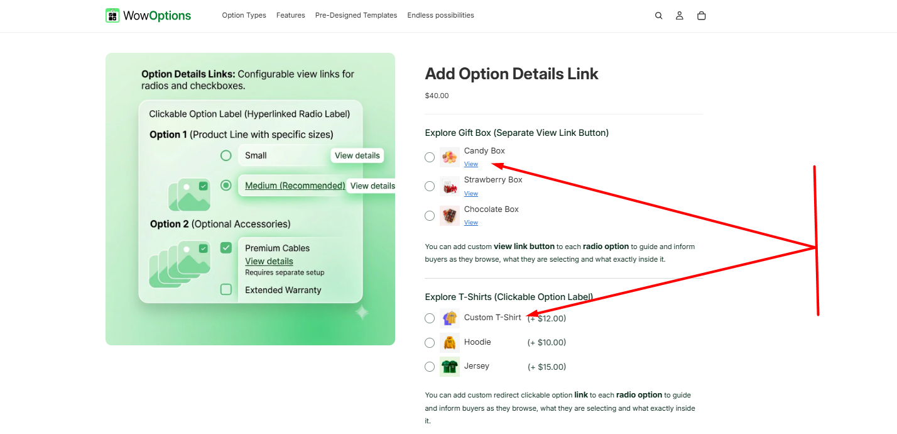
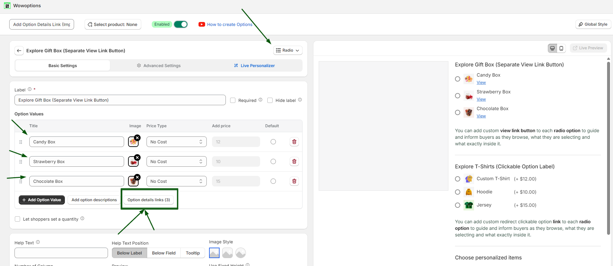
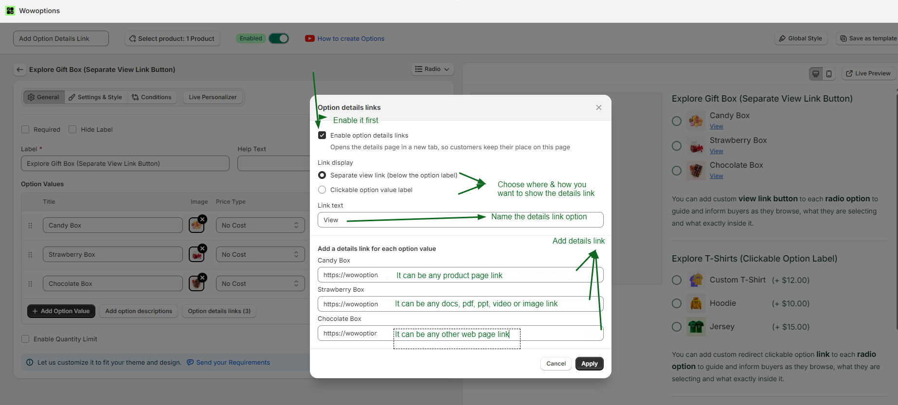
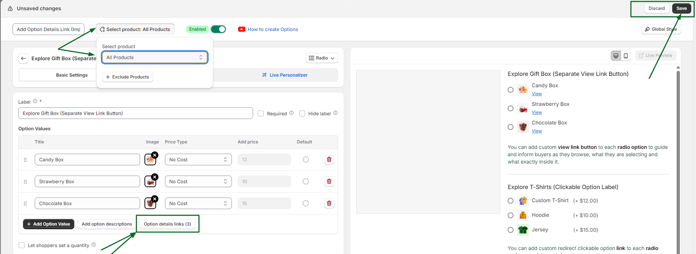

# View Details Link

View Details Link in WowOptions helps Shopify merchants add clickable links to individual option values. Instead of adding too much information directly inside the product option area, merchants can guide customers to a product page, size guide, material guide, sample page, instruction page, or any custom URL.

This feature is useful when an option needs more explanation before the customer selects it. WowOptions is built for flexible Shopify product options, including custom fields, price add-ons, swatches, conditional logic and product personalization; the Shopify listing also mentions Option Details Link as part of the app’s feature set.

## When and Why You Should Use View Details Link

Use View Details Link when customers need extra information about an option value, but you do not want to make the product page too long or crowded.

Some product options need more than a short label. A customer may want to check the material, compare an add-on, view a size guide, read care instructions or see a related product before selecting the option.

View Details Link helps merchants:

* Keep product pages clean and easy to scan
* Provide extra information only when customers need it
* Help shoppers understand add-ons, upgrades, or services better
* Reduce confusion before checkout
* Link option values to product pages, guides, samples, or custom URLs
* Improve customer confidence during product customization
* Support better cross-selling from the product option area

This feature works especially well for stores selling add-ons, accessories, premium upgrades, technical products, custom services, bundles, or products that need extra explanation before purchase.

## Supported Option Types

You can use View Details Link in different ways depending on how you want customers to interact with the option value.

Supported link display types include:

* Separate View Button Link
* Clickable Option Label
* View Link on Check Boxes

These options help merchants decide whether the link should appear as a separate View button/link or make the option label itself clickable.

## How to setup with real use case

Imagine Max is having a gift store with multiple gift options like candy box, strawberry box, chocolate box etc. Different customers can choose different gift items. And under each gift item there is a view link to showcase the details of the gift items. Like this:

To set up the view details link using wowoptions follow the steps below.

### Step 1

- At first you need to create an option set and make a list of your gift items. To do that you can use a radio button (option type) for showcasing the gift items.
- Add your options/gift items to the option set. Like below:
- Below the options, you can see the button of “Option details link”.

**Step 2**: Once you click on the “Option details link” button. You will get a new tab to add option details. Click on the enable button.

- After clicking on the enable button, you can add the links of the details of the products.
- Add the link label that you want to show to your customers. Like: view or view buttons.
- Then add the details link of each item that you want to show to your customers.
- Click on apply to save. Like the image below:

### Step 3

- After setting it up, you will see the detailed view links within the product. Do not forget to add this option set to your product.
- Then finally save it to make it workable within your store. Like below:

## Need Help with Setup?

If you need help setting up View Details Link, the WowOptions support team can assist you through the in-app live chat.

You can contact support if the link is not appearing correctly, if you are unsure which link style to use, or if you need help adding links to checkbox items, option labels, product pages, guides. WowOptions also lists live chat and support options for merchants on its product materials.
