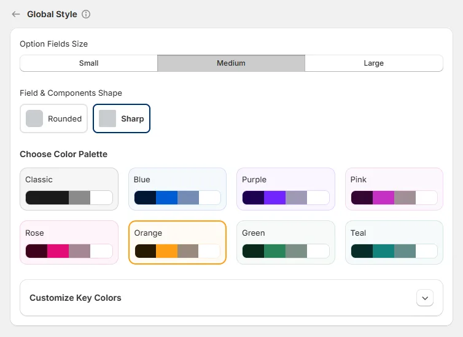
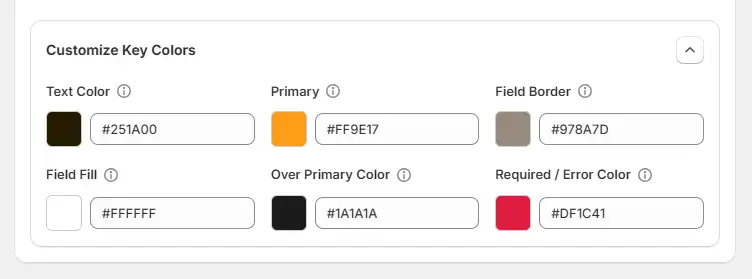

# Global Style

The Global Style settings allow you to control the overall look and feel of all option fields across your store. These settings are applied globally, helping you maintain a consistent and clean design without styling each field individually.

## Option Fields Size

Controls the overall size of all option fields and inputs.

* **Small** — More compact layout with tighter spacing
* **Medium** — Balanced size suitable for most stores
* **Large** — Bigger fields for better visibility and easier interaction

## Field & Components Shape

Defines the visual shape of input fields and UI elements.

* **Rounded** — Applies rounded corners for a softer, modern look
* **Sharp** — Uses straight edges for a more minimal and structured look

## Choose Color Palette

Sets the color theme used across buttons, selections, and interactive elements. Available palettes include:

* Classic
* Blue
* Purple
* Pink
* Rose
* Orange
* Green
* Teal

Each palette affects elements such as:

* Buttons
* Selected states
* Highlights
* Interactive components

This helps ensure your product options match your store's branding and visual style.

