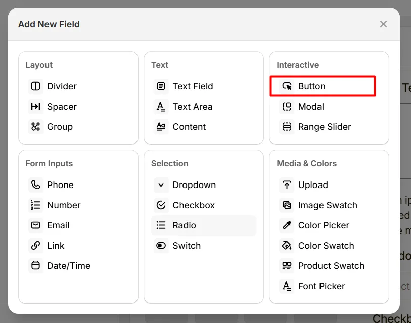
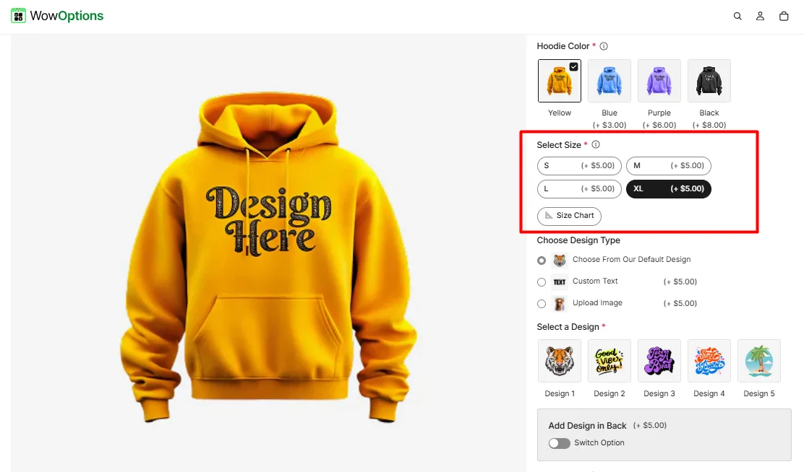
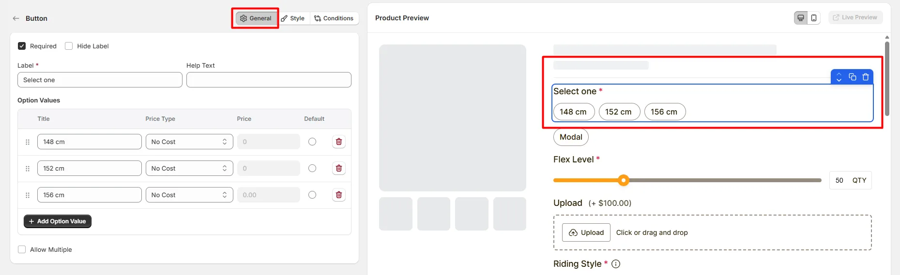
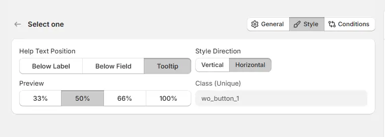

# Button

The **Button** option lets customers trigger an action, such as opening a guide, applying a configuration, or starting a customization step.  Here's an example of how the Button appears on the frontend

## General Tab (Basic Settings)

This tab controls the core configuration of the Button option, including the label, help text, selectable button options, pricing behavior, and selection rules. 

### Required

Enable this option to make the button selection mandatory. Customers must choose at least one option before they can add the product to the cart.

### Hide Label

Hide the field label from customers. Enable this when the context of the options is already clear or when you want a minimal layout.

### Label

The visible name shown to customers (for example: “Select Size”, “Choose Material”, or “Gift Wrap Options”). Keep the label short and descriptive so customers understand what they need to select.

### Help Text

Short instructional text shown to customers to guide their selection.

Examples:

* “Choose your preferred option”
* “Select one style”
* “You may select multiple options”

The display position of the help text can be controlled in the **Style Tab**.

### Option Values

Defines the selectable button options that customers can choose from.

Each option includes the following settings:

* **Title:** The name displayed on the button
* **Price Type:** Determines how the option affects the product price.
* **Price:** The amount added to the product price when the option is selected.
* **Default:** Sets the option as pre-selected when the product page loads.

Available price types include:

* **No Cost:** The option does not add any additional cost.
* **Fixed:** Adds a fixed amount to the product price.
* **Percentage:** Adds a percentage based on the product price.

Use **Add Option Value** to create additional selectable buttons.

### Allow Multiple

Enable this option to allow customers to select more than one button option. This is useful for selections such as add-ons or extra features.

### Number of Selection Allowed

Limits how many options customers can select.

* **Minimum Selection:** Sets the minimum number of options customers must select.
* **Maximum Selection:** Sets the maximum number of options customers can select.

Example:

* Minimum **1**, Maximum **1** → single selection
* Minimum **1**, Maximum **3** → choose up to three options

## Style Tab (Layout & Appearance)

This tab controls how the Button options appear on the product page, including help text placement, button layout direction, field width, and custom styling. 

### Help Text Position

Controls where the help text appears relative to the field.

* **Below Label:** Help text appears under the field label.
* **Below Field:** Help text appears below the button options.
* **Tooltip:** Help text appears inside an information icon, saving space in the layout.

### Style Direction

Controls how the buttons are arranged on the product page.

* **Vertical:** Buttons appear stacked in a vertical list.
* **Horizontal:** Buttons appear side-by-side in a horizontal layout.

### Field Width

Controls how wide the button field appears within the options layout.

* **33%** – narrow column
* **50%** – half width
* **66%** – wide column
* **100%** – full width

### Class (Unique)

A unique CSS class assigned to the button field (example: `wo_button_1`).

Use this if you want to:

* apply custom CSS styling
* target the field with custom scripts
* customize its appearance using theme code

## Conditions Tab

Use this tab to control the visibility of the Button option. You can show or hide it only when specific custom options or Shopify variants are selected. To learn how to configure conditional logic, follow this guide.

## Get Support 👇

If you experience any issues while configuring the Button option, reach out to the WowApps support team via the in-app chat or email [**support@wowapps.io**](mailto:support@wowapps.io). You can also reach the dedicated manager at [**nayeem@wowapps.io**](mailto:nayeem@wowapps.io).
