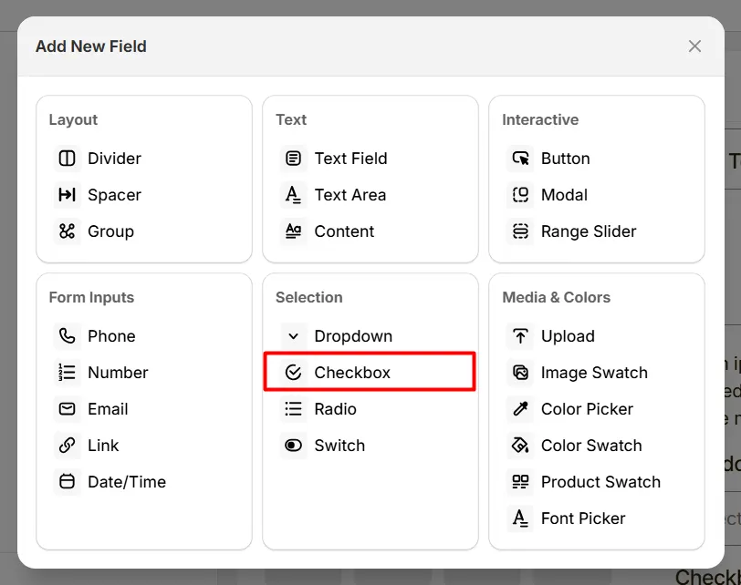
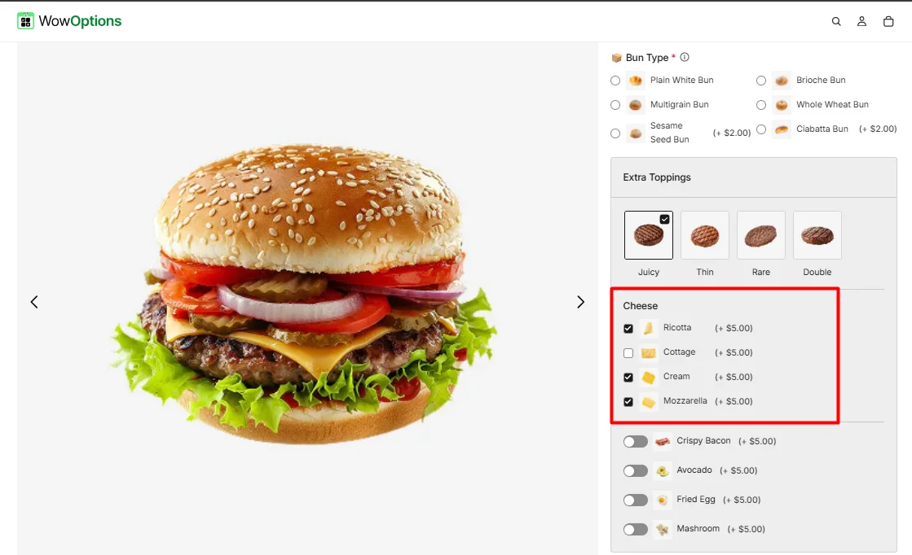
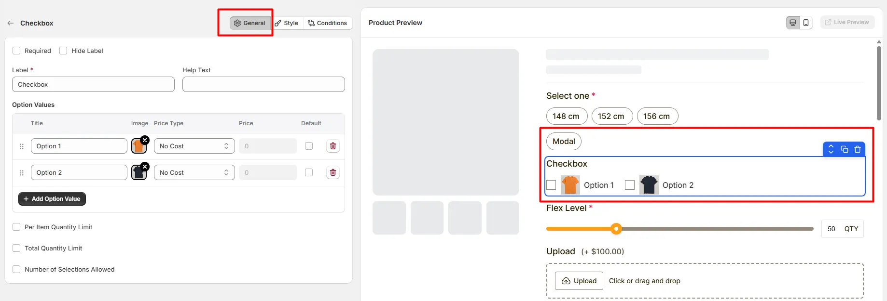
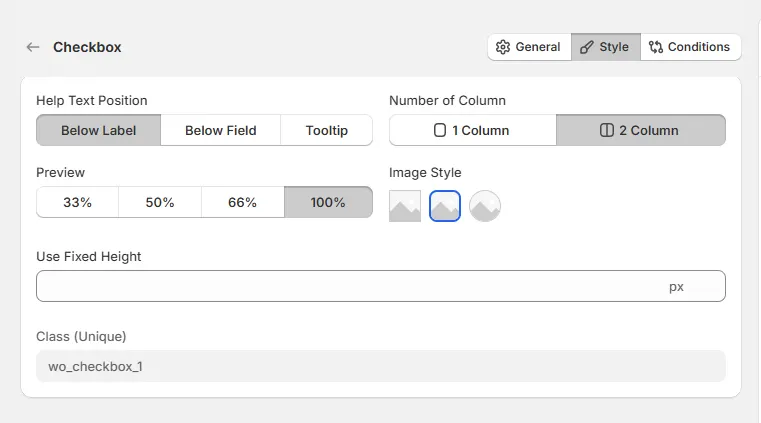

# Checkbox

The Checkbox option lets customers select multiple options, such as add-ons, accessories, or extra features.

Here’s an example of how the Checkbox appears on the frontend

## General Tab (Basic Settings)

This tab controls the core configuration of the Checkbox field, including the label, help text, selectable options, pricing behavior, and selection limits. 

### Required

Enable this option to make the checkbox selection mandatory. Customers must select at least one option before they can add the product to the cart.

### Hide Label

Hide the field label from customers. Enable this when the purpose of the checkbox group is already clear or when you want a minimal layout.

### Label

The visible name shown to customers (for example: "Add-ons", "Extra Features", or "Select Options"). Keep the label short and descriptive so customers understand what they can select.

### Help Text

Short instructional text shown to customers to guide their selection. For examples:

* "Select one or more options"
* "Choose additional features"
* "Pick the extras you want"

The display position of the help text can be controlled in the Style Tab.

### Option Values

Defines the list of selectable checkbox options. Each option includes the following settings:

* **Title**: The name displayed next to the checkbox.
* **Image**: Optional image icon associated with the option.
* **Price Type**: Determines how the option affects the product price.
* **Price**: The amount added to the product price when the option is selected.
* **Default**: Sets the option as pre-selected when the product page loads.

Available price types include:

* **No Cost**: The option does not add any additional cost.
* **Fixed**: Adds a fixed amount to the product price.
* **Percentage**: Adds a percentage based on the product price.

Use Add Option Value to create additional checkbox options.

### Per Item Quantity Limit

Allows you to restrict how many times each individual option can be selected.

* **Min Quantity**: The minimum quantity allowed for the option.
* **Max Quantity**: The maximum quantity allowed for the option.

### Total Quantity Limit

Limits the total number of selected items across all checkbox options.

* **Min Quantity**: Minimum total selections allowed.
* **Max Quantity**: Maximum total selections allowed.

For Example: Limit the total selections to 3 add-ons across all options.

### Number of Selections Allowed

Controls how many checkbox options customers can select.

* **Minimum Selection**: Minimum number of options that must be selected.
* **Maximum Selection**: Maximum number of options customers can choose.

## Style Tab (Layout & Appearance)

This tab controls how the Checkbox field appears on the product page, including help text placement, layout columns, option image style, field width, and custom styling. 

### Help Text Position

Controls where the help text appears relative to the field.

* **Below Label**: Help text appears under the field label.
* **Below Field**: Help text appears below the checkbox options.
* **Tooltip**: Help text appears inside an information icon, saving space in the layout.

### Number of Column

Controls how the checkbox options are arranged.

* **1 Column**: Displays options in a vertical list.
* **2 Column**: Displays options in two side-by-side columns.

### Field Width

Controls how wide the checkbox field appears within the options layout.

* **33%** - narrow column
* **50%** - half width
* **66%** - wide column
* **100%** - full width

### Image Style

Controls how option images appear next to the checkbox options.

* **Square Image**: Displays option images with square corners.
* **Rounded Image**: Displays option images with slightly rounded corners.
* **Circular Image**: Displays option images in a circular format.

### Use Fixed Height

Defines a fixed height for the checkbox option container. This helps maintain consistent layout when options contain images or long labels.

### Class (Unique)

A unique CSS class assigned to the checkbox field (example: `wo_checkbox_1`).

Use this if you want to:

* apply custom CSS styling
* target the field with custom scripts
* customize its appearance using theme code

## Conditions Tab

Use this tab to control the visibility of the Checkbox option. You can show or hide it only when specific custom options or Shopify variants are selected. To learn how to configure conditional logic, follow this guide.

## Get Support

If you experience any issues while configuring the Checkbox option, reach out to the WowApps support team via the in-app chat or email [**support@wowapps.io**](mailto:support@wowapps.io). You can also reach the dedicated manager at [**nayeem@wowapps.io**](mailto:nayeem@wowapps.io).
