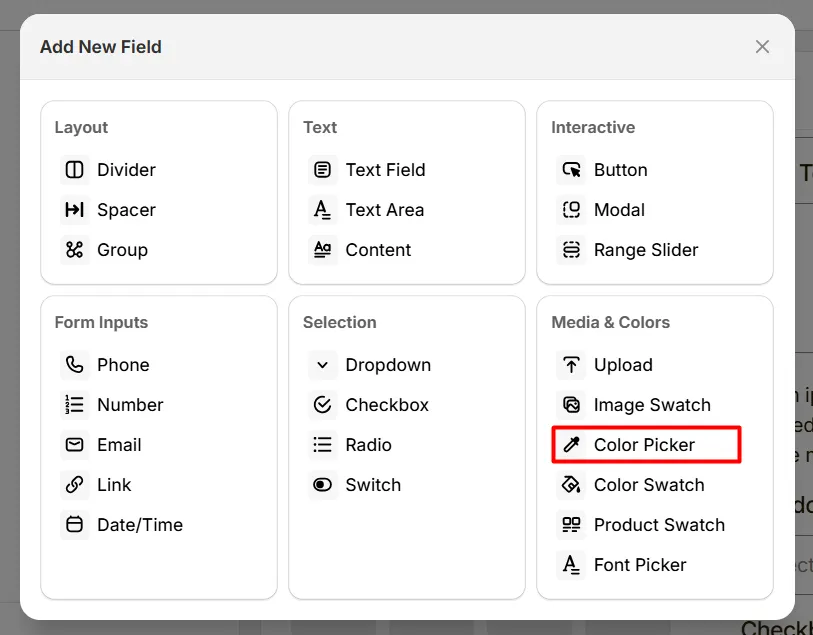
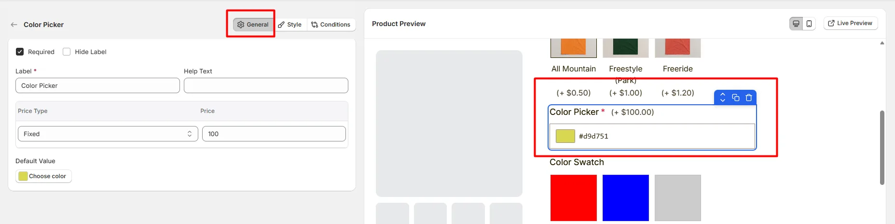
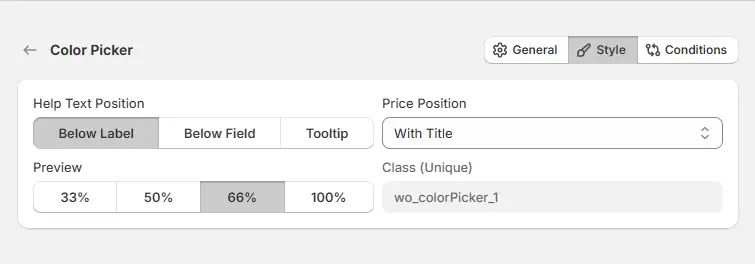

# Color Picker

The **Color Picker** option lets customers choose any color using a color selection tool. 

Here's an example of how the Color Picker appears on the frontend

## General Tab (Basic Settings)

This tab controls the Color Picker field configuration, including the label, help text, pricing behavior, and default color value. 

### Required

Enable this option to make the color selection mandatory. Customers must choose a color before they can add the product to the cart.

### Hide Label

Hide the field label from customers. Use this when the purpose of the color picker is already clear or when you want a cleaner layout.

### Label

The visible name shown to customers (e.g., “Choose Color”, “Select Theme Color”, or “Pick Your Color”). Keep it short and clear so customers understand the purpose of the field.

### Help Text

Short instructional text shown to customers. For examples:

* Choose your preferred color
* Select a custom color for your product
* Pick any color from the palette

The position of the help text can be controlled in the **Style Tab**.

### Price Type

Determines how the selected color affects the product price.

Available options include:

* **Fixed:** Adds a fixed amount to the product price.
* **Percentage:** Adds a percentage based on the product price.
* **No Cost:** Selecting a color does not affect the product price.

### Price

Defines the additional cost applied when a color is selected.

### Default Value

Defines the default color shown when the product page loads. Customers can change the color using the color picker interface. For example: `#000000`

## Style Tab (Layout & Appearance)

This tab controls how the Color Picker field appears on the product page, including help text placement, price position, and field width. 

### Help Text Position

Controls where the help text appears relative to the field label.

* **Below Label:** Help text appears under the field label. Best for readability and accessibility.
* **Below Field:** Help text appears below the color picker field.
* **Tooltip:** Help text appears inside a small info icon.

### Price Position

Controls where the additional price (if any) is displayed.

* **With Title:** The price appears next to the field label.
* **With Option:** The price appears beside the color picker field.

### Field Width

Controls how wide the color picker field appears relative to the available option area.

* **33%** — narrow column
* **50%** — half-width column
* **66%** — wider column
* **100%** — full width (default for most layouts)

### Class (Unique)

A unique CSS class for this field (example shown: `wo_colorPicker_1`). Use this when you want to style the field with custom CSS or target it with scripts.

## Conditions Tab

Use this tab to control the visibility of the Color Picker option. You can show or hide it only when specific custom options or Shopify variants are selected. To learn how to configure conditional logic, follow this guide.

## Get Support 👇

If you experience any issues while configuring the Color Picker option, reach out to the WowApps support team via the in-app chat or email [**support@wowapps.io**](mailto:support@wowapps.io). You can also reach the dedicated manager at [**nayeem@wowapps.io**](mailto:nayeem@wowapps.io).
