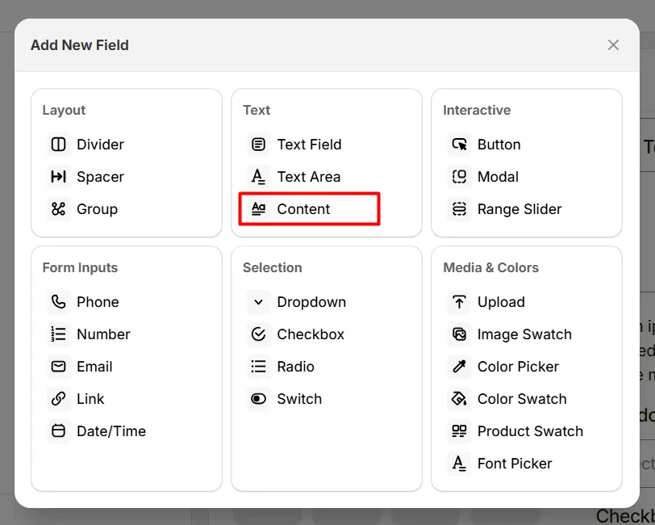
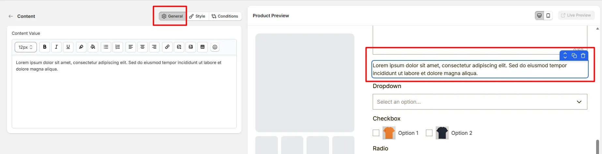
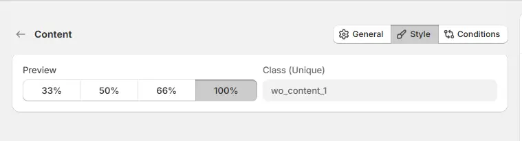

# Content

The **Content** option lets you display static text or information on the product page, such as instructions, descriptions, or personalization guidelines.

Here's an example of how the Content appears on the frontend

## General Tab (Basic Settings)

This tab controls the main content displayed to customers, including formatted text, images, links, tables, and other visual elements.

### Content Value

Defines the content that will appear on the product page. You can add formatted text, instructions, images, links, tables, or other informational elements.

Use the editor toolbar to format the content. Available formatting options include:

- **Font Size** – adjust the size of the text
- **Bold** – emphasize important text
- **Italic** – style text for emphasis
- **Underline** – highlight specific words or phrases
- **Text Color** – change the color of the text
- **Highlight Color** – add background highlight to text
- **Bullet List** – create unordered lists
- **Numbered List** – create ordered lists
- **Text Alignment** – align text left, center, or right
- **Insert Link** – add clickable URLs
- **Insert Image** – display images using an image URL
- **Insert Table** – create structured table layouts
- **Emoji Picker** – insert emoji icons

**This field is useful for displaying information such as:**

- product customization instructions
- engraving guidelines
- shipping notes
- promotional messages
- size charts or specification tables

## Style Tab (Layout & Appearance)

This tab controls how the content block appears on the product page, including layout width and custom styling.

### Field Width

Controls how wide the content block appears within the options layout.

- **33%** – narrow column
- **50%** – half width
- **66%** – wide column
- **100%** – full width (recommended for content sections)

### Class (Unique)

A unique CSS class assigned to the content block (example: `wo_content_1`).

Use this if you want to:

- apply custom CSS styling
- target the content block with custom scripts
- customize its appearance using theme code

## Conditions Tab

Use this tab to control the visibility of the Content option. You can show or hide it only when specific custom options or Shopify variants are selected. To learn how to configure conditional logic, follow this guide.

## Get Support 👇

If you experience any issues while configuring the Content option, reach out to the WowApps support team via the in-app chat or email <a href="mailto:support@wowapps.io">**support@wowapps.io**</a>. You can also reach the dedicated manager at <a href="mailto:nayeem@wowapps.io">**nayeem@wowapps.io**</a>.
