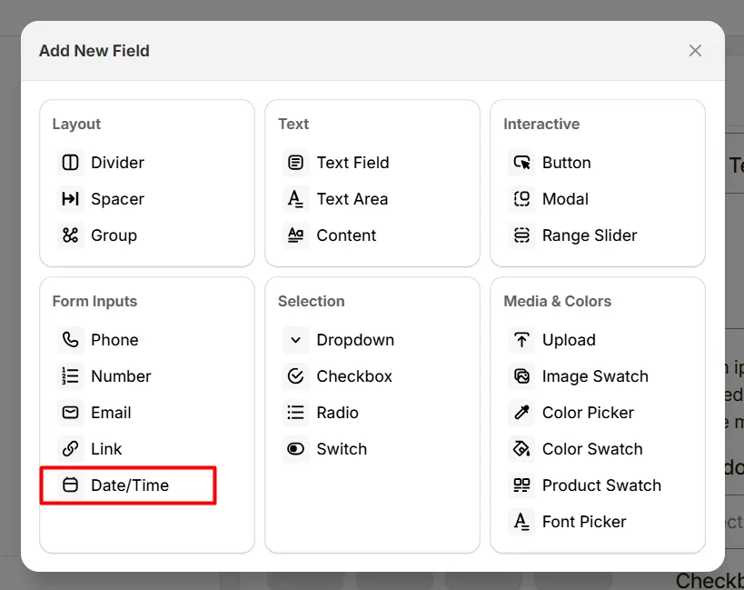
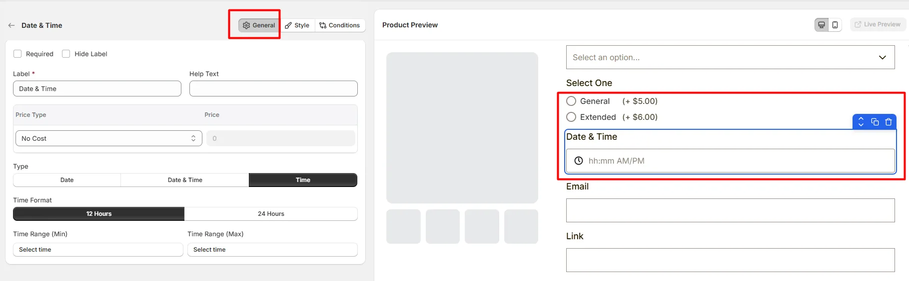
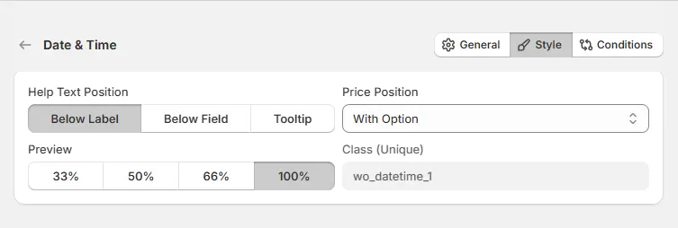

# Date Time

The **Date and Time** option lets customers select a specific date or time, such as a delivery date, appointment time, or event date.

Here's an example of how the Date & Time Field appears on the frontend

## General Tab (Basic Settings)

This tab controls the core configuration of the Date & Time field, including the label, help text, pricing behavior, date or time selection type, and available date or time restrictions.

### Required

Enable this option to make the date or time selection mandatory. Customers must select a valid date or time before they can add the product to the cart.

### Hide Label

Hide the field label from customers. Enable this when the purpose of the field is already clear or when you want a minimal layout.

### Label

The visible name shown to customers (for example: “Delivery Date”, “Appointment Time”, or “Booking Schedule”). Keep the label short and descriptive so customers understand what they need to select.

### Help Text

Short instructional text shown to customers to guide their selection. For examples:

* “Select your preferred delivery date”
* “Choose an available appointment time”
* “Pick a date for your event”

The display position of the help text can be controlled in the **Style Tab**.

### Price Type

Defines how the selected date or time affects the product price.

* **No Cost:** The selection does not add any additional cost.
* **Fixed:** Adds a fixed amount to the product price.
* **Percentage:** Adds a percentage based on the product price.

### Price

The amount added to the product price based on the selected **Price Type**. For example:

* Fixed fee for scheduled delivery
* Percentage-based scheduling service fee

### Type

Defines what customers can select.

* **Date:** Customers select a calendar date.
* **Date & Time:** Customers select both a date and a time.
* **Time:** Customers select only a time value.

Use the appropriate option depending on whether the product requires a specific day, a time slot, or both.

### Date Format

Controls how the selected date is displayed. Choose a format that matches your store's regional date format from a list of pre-defined format.

### Min Date and Max Date

Defines the earliest and the latest date customers are allowed to select.

* **None:** No restriction on the minimum date.
* **Current Day:** Customers can only select today or future dates.
* **Custom:** Set a specific starting date.

Example: Limit bookings within a specific future time range.

### Disable Today

Enable this option to prevent customers from selecting the current day.

This is useful when same-day bookings or deliveries are not allowed.

### Disable Specific Dates

Allows you to block specific calendar dates from being selected. For example:

* Holidays
* Store closure dates
* Fully booked days

### Disable Weekdays

Allows you to disable certain days of the week. For example: Disable **Saturday and Sunday** for business-day deliveries.

### Disable Monthly Days

Allows you to disable specific days of each month. Example: Disable the **1st and 15th** of every month.

### Time Format

Controls how the time selector is displayed.

* **12 Hours:** Displays time using AM and PM.
* **24 Hours:** Displays time using the 24-hour format.

### Time Range (Min and Max)

Defines the earliest and the latest time customers can select. This allows you to restrict selections to your available working hours.

## Style Tab (Layout & Appearance)

This tab controls how the Date & Time field appears on the product page, including help text placement, price display position, field width, and custom styling.

### Help Text Position

Controls where the help text appears relative to the field.

* **Below Label:** Help text appears under the field label.
* **Below Field:** Help text appears below the date or time input field.
* **Tooltip:** Help text appears inside an information icon, saving space in the layout.

### Price Position

Controls where the price adjustment label appears.

* **With Title:** The price appears next to the field label.
* **With Option:** The price appears near the date or time selection field.

### Field Width

Controls how wide the date and time field appears within the options layout.

* **33%** - narrow column
* **50%** - half width
* **66%** - wide column
* **100%** - full width

### Class (Unique)

A unique CSS class assigned to the date and time field (example: `wo_datetime_1`). Use this if you want to:

* apply custom CSS styling
* target the field with custom scripts
* customize its appearance using theme code

## Conditions Tab

Use this tab to control the visibility of the Date/Time option. You can show or hide it only when specific custom options or Shopify variants are selected. To learn how to configure conditional logic, follow this guide.

## Get Support 👇

If you experience any issues while configuring the Date/Time option, reach out to the WowApps support team via the in-app chat or email [**support@wowapps.io**](mailto:support@wowapps.io). You can also reach the dedicated manager at [**nayeem@wowapps.io**](mailto:nayeem@wowapps.io).
