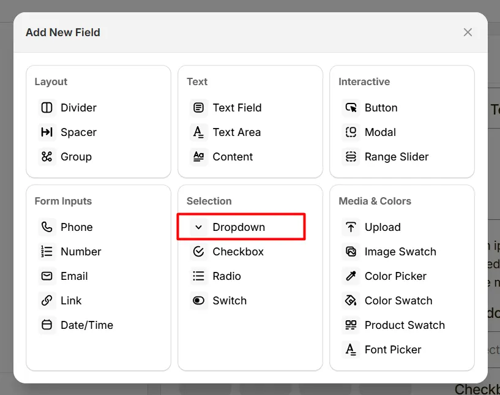
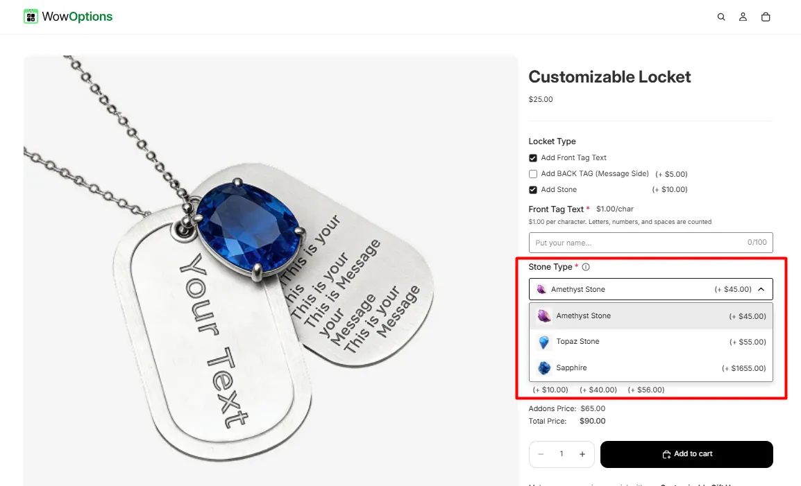
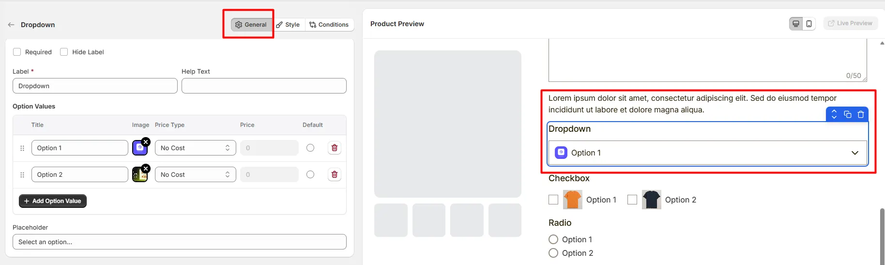
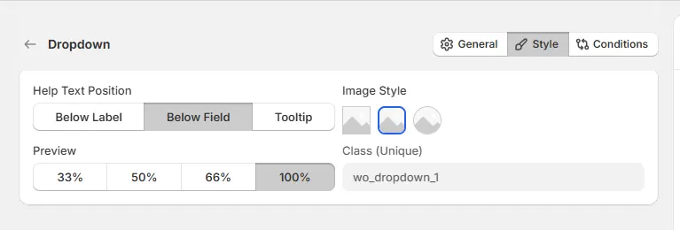

# Dropdown

The **Dropdown** option lets customers select one option from a list, such as size, material, or style.

Here's an example of how the Dropdown appears on the frontend

## General Tab (Basic Settings)

This tab controls the core configuration of the Dropdown field, including the label, help text, selectable options, pricing behavior, and placeholder text.

### Required

Enable this option to make the dropdown selection mandatory. Customers must choose an option before they can add the product to the cart.

### Hide Label

Hide the field label from customers. Enable this when the purpose of the dropdown is already clear or when you want a minimal layout.

### Label

The visible name shown to customers (for example: “Select Size”, “Choose Material”, or “Delivery Option”). Keep the label short and descriptive so customers understand what they need to select.

### Help Text

Short instructional text shown to customers to guide their selection. Examples:

* “Select one option”
* “Choose your preferred size”
* “Pick a delivery method”

The display position of the help text can be controlled in the **Style Tab**.

### Option Values

Defines the list of selectable options displayed in the dropdown.

Each option includes the following settings:

* **Title:** The name displayed in the dropdown list.
* **Image:** Optional image icon associated with the option.
* **Price Type:** Determines how the option affects the product price.
* **Price:** The amount added to the product price when the option is selected.
* **Default:** Sets the option as the default selected value when the product page loads.

Available price types include:

* **No Cost:** The option does not add any additional cost.
* **Fixed:** Adds a fixed amount to the product price.
* **Percentage:** Adds a percentage based on the product price.

Use **Add Option Value** to create additional dropdown options.

### Placeholder

Defines the placeholder text shown before a selection is made. This helps guide customers to choose a value from the dropdown.

## Style Tab (Layout & Appearance)

This tab controls how the Dropdown field appears on the product page, including help text placement, option image style, field width, and custom styling.

### Help Text Position

Controls where the help text appears relative to the field.

* **Below Label:** Help text appears under the field label.
* **Below Field:** Help text appears below the dropdown field.
* **Tooltip:** Help text appears inside an information icon, saving space in the layout.

### Image Style

Controls how option images appear inside the dropdown.

* **Square Image:** Displays option images with square corners.
* **Rounded Image:** Displays option images with slightly rounded corners.
* **Circular Image:** Displays option images in a circular format.

### Field Width

Controls how wide the dropdown field appears within the options layout.

* **33%** – narrow column
* **50%** – half width
* **66%** – wide column
* **100%** – full width

### Class (Unique)

A unique CSS class assigned to the dropdown field (example: `wo_dropdown_1`). Use this if you want to:

* apply custom CSS styling
* target the field with custom scripts
* customize its appearance using theme code

## Conditions Tab

Use this tab to control the visibility of the Dropdown option. You can show or hide it only when specific custom options or Shopify variants are selected. To learn how to configure conditional logic, follow this guide.

## Get Support 👇

If you experience any issues while configuring the Dropdown option, reach out to the WowApps support team via the in-app chat or email [**support@wowapps.io**](mailto:support@wowapps.io). You can also reach the dedicated manager at [**nayeem@wowapps.io**](mailto:nayeem@wowapps.io).
