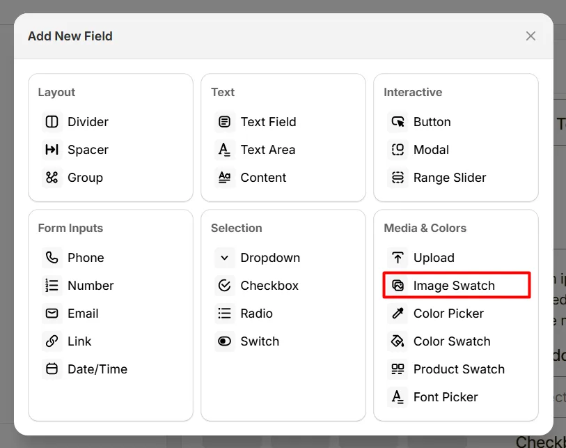
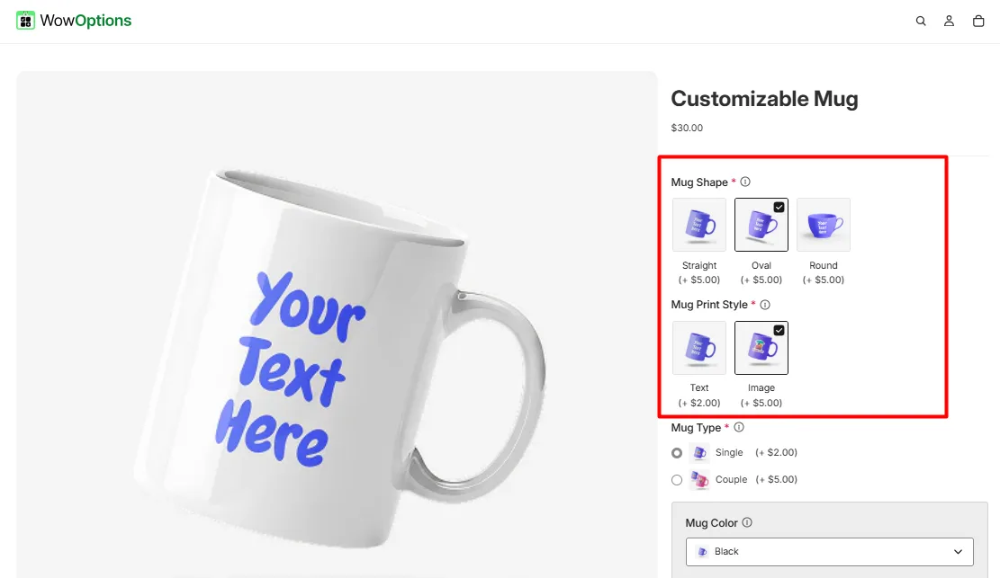
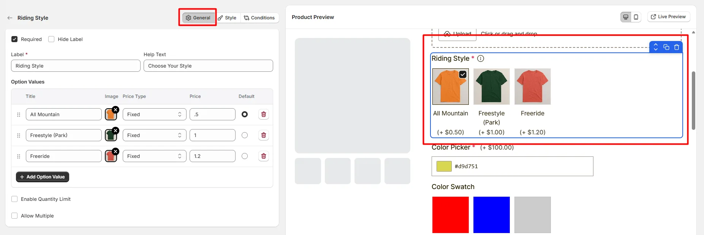
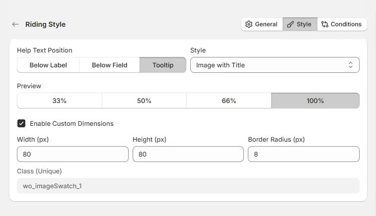

# Image Swatch

The **Image Swatch** option lets customers choose an option using images, such as selecting patterns, styles, or product variations.

Here's an example of how the Image Swatch appears on the frontend

## General Tab (Basic Settings)

This tab controls the core configuration of the Image Swatch field, including the label, help text, selectable options, pricing behavior, and selection limits.

### Required

Enable this option to make selecting an image swatch mandatory. Customers must choose at least one option before they can add the product to the cart.

### Hide Label

Hide the field label from customers. Use this when the purpose of the swatch group is already clear from surrounding content.

### Label

The visible name shown to customers (for example: “Choose Color”, “Select Design”, or “Pick a Style”). Keep the label short and descriptive so customers understand what they need to select.

### Help Text

Short instructional text shown to guide customers. For examples:

* Select your preferred color
* Choose a design option
* Pick one or more styles

The position of this help text can be controlled from the **Style Tab**.

### Option Values

Defines the selectable swatch options shown to customers. Each option represents a visual choice displayed with an image. Each option includes the following settings:

* **Title:** The name displayed under or beside the image swatch.
* **Image:** Upload or assign the image representing the option.
* **Price Type:** Determines how the option affects the product price.
* **Price:** Defines the additional cost applied when the option is selected.
* **Default:** Sets the option as the default selected value when the product page loads.

Available options include:

* **Fixed** — adds a fixed amount to the product price
* **Percentage** — adds a percentage based on the product price
* **No Cost** — selecting the option does not change the product price

Use the **Add Option Value** button to add more swatch options.

### Enable Quantity Limit

Allows you to limit the quantity associated with each selected option.

* **Min Quantity:** Defines the minimum quantity allowed for the option.
* **Max Quantity:** Defines the maximum quantity allowed.

### Allow Multiple

Allows customers to select multiple image swatches instead of only one.

### Total Quantity Limit

Limits the total quantity across all selected swatch options.

* **Min Quantity:** Defines the minimum total quantity allowed.
* **Max Quantity:** Defines the maximum total quantity allowed.

### Number of Selection Allowed

Controls how many swatches a customer can select.

* **Minimum Selection:** Defines the minimum number of options that must be selected.
* **Maximum Selection:** Defines the maximum number of options that can be selected.

## Style Tab (Layout & Appearance)

This tab controls how the Image Swatch field appears on the product page, including help text placement, swatch style, layout width, and custom image dimensions.

### Help Text Position

Controls where the help text appears relative to the field.

* **Below Label:** Help text appears under the field label.
* **Below Field:** Help text appears below the swatch options.
* **Tooltip:** Help text appears inside an information icon.

### Display Style

Controls how the swatches are displayed.

* **Image with Title:** Displays the image along with its option title.
* **Only Image:** Displays only the image without showing the title.

### Field Width

Controls how wide the swatch field appears in the product options layout.

* **33%** — narrow column
* **50%** — half width
* **66%** — wider column
* **100%** — full width

### Enable Custom Dimensions

Allows you to manually control the size and shape of the swatch images.

* **Width (px):** Defines the width of each swatch image.
* **Height (px):** Defines the height of each swatch image.
* **Border Radius (px):** Controls how rounded the image corners appear.

Example:

* Width: 80 px
* Height: 80 px
* Border Radius: 8 px

### Class (Unique)

A unique CSS class assigned to the image swatch field (example: `wo_imageSwatch_1`). This can be used to apply custom CSS styling or target the field using scripts.

## Conditions Tab

Use this tab to control the visibility of the Image Swatch option. You can show or hide it only when specific custom options or Shopify variants are selected. To learn how to configure conditional logic, follow this guide.

## Get Support 👇

If you experience any issues while configuring the Image Swatch option, reach out to the WowApps support team via the in-app chat or email [**support@wowapps.io**](mailto:support@wowapps.io). You can also reach the dedicated manager at [**nayeem@wowapps.io**](mailto:nayeem@wowapps.io).
