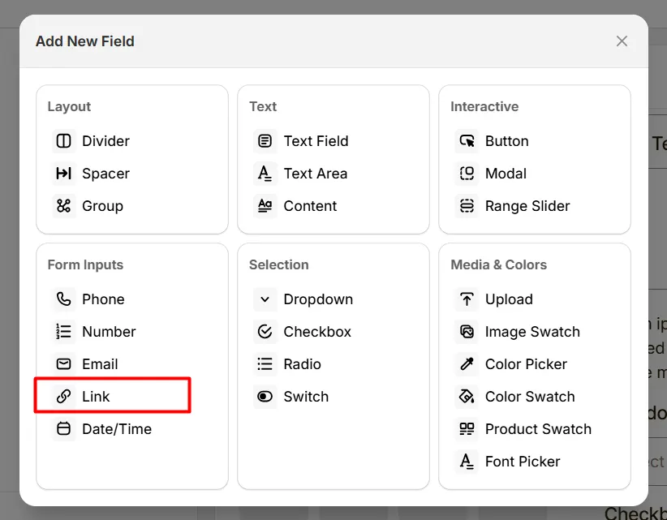
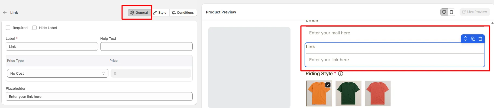
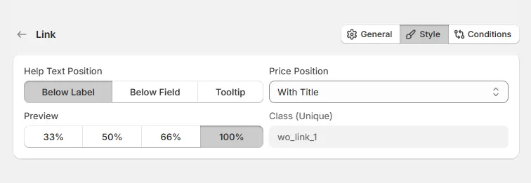

# Link

The **Link** option lets customers provide a URL, such as a reference image link or design file.

Here's an example of how the Link Field appears on the frontend

## General Tab (Basic Settings)

This tab controls the core configuration of the Link field, including the label, help text, pricing behavior, and placeholder text.

### Required

Enable this option to make the link field mandatory. Customers must enter a valid URL before they can add the product to the cart.

### Hide Label

Hide the field label from customers. Enable this when the purpose of the field is already clear or when you want a minimal layout.

### Label

The visible name shown to customers (for example: “Website Link”, “Design URL”, or “Reference Link”). Keep the label short and descriptive so customers understand what type of link they should provide.

### Help Text

Short instructional text shown to customers to guide their input. Examples:

* “Paste the link to your design file”
* “Provide a reference URL”
* “Enter a valid website link”

The display position of the help text can be controlled in the **Style Tab**.

### Price Type

Defines how the entered link affects the product price.

* **No Cost:** The field does not add any additional cost.
* **Fixed:** Adds a fixed amount to the product price.
* **Percentage:** Adds a percentage based on the product price.
* **Per Character:** Charges based on the number of characters entered in the link.
* **Per Character (No Space):** Charges per character while ignoring spaces.
* **Per Word:** Charges based on the number of words entered.

### Price

The amount added to the product price based on the selected **Price Type**. For example:

* Fixed fee for external design submission
* Pricing adjustment based on the length of the provided link

### Placeholder

Example text displayed inside the input box before the customer types. Use placeholders to guide the customer on what to enter. Example: https://example.com/design-file

## Style Tab (Layout & Appearance)

This tab controls how the Link field appears on the product page, including help text placement, price display position, field width, and custom styling.

### Help Text Position

Controls where the help text appears relative to the field.

* **Below Label:** Help text appears under the field label.
* **Below Field:** Help text appears below the link input field.
* **Tooltip:** Help text appears inside an information icon, saving space in the layout.

### Price Position

Controls where the price adjustment label appears.

* **With Title:** The price appears next to the field label.
* **With Option:** The price appears near the link input field.

### Field Width

Controls how wide the link field appears within the options layout.

* **33%** – narrow column
* **50%** – half width
* **66%** – wide column
* **100%** – full width

### Class (Unique)

A unique CSS class assigned to the link field (example: `wo_link_1`).

Use this if you want to:

* apply custom CSS styling
* target the field with custom scripts
* customize its appearance using theme code

## Conditions Tab

Use this tab to control the visibility of the Link option. You can show or hide it only when specific custom options or Shopify variants are selected. To learn how to configure conditional logic, follow this guide.

## Get Support 👇

If you experience any issues while configuring the Link option, reach out to the WowApps support team via the in-app chat or email [**support@wowapps.io**](mailto:support@wowapps.io). You can also reach the dedicated manager at [**nayeem@wowapps.io**](mailto:nayeem@wowapps.io).
