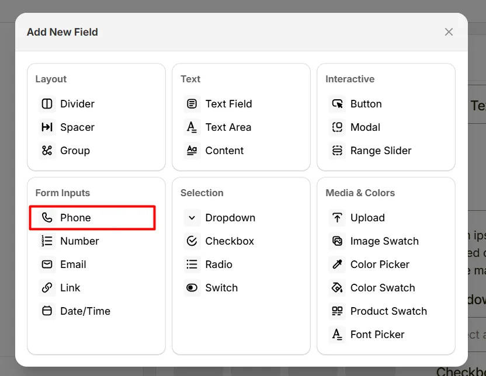
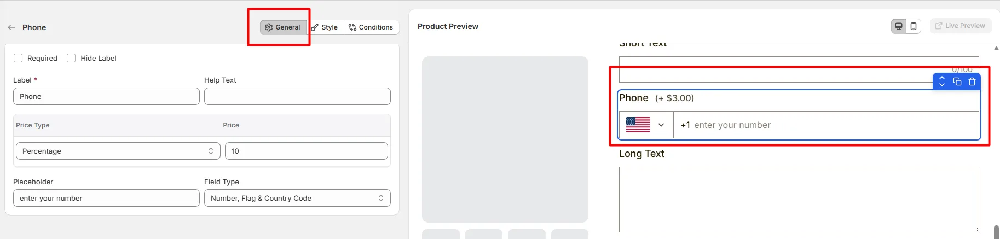
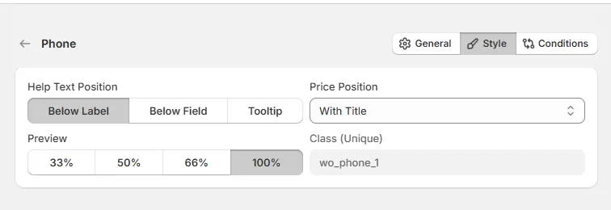

# Phone

The **Phone** option lets customers enter a phone number, such as a contact number for delivery or support.

Here's an example of how the Phone Field appears on the frontend

## General Tab (Basic Settings)

This tab controls the core configuration of the Phone field, including the label, help text, pricing behavior, placeholder text, and phone input format.

### Required

Enable this option to make the phone number field mandatory. Customers must enter a phone number before they can add the product to the cart.

### Hide Label

Hide the field label from customers. Enable this when the purpose of the field is already clear or when you want a minimal layout.

### Label

The visible name shown to customers (for example: “Phone Number”, “Contact Number”, or “Mobile”). Keep the label short and descriptive so customers understand what information is required.

### Help Text

Short instructional text shown to customers to guide their input. The display position of the help text can be controlled in the Style Tab.

Examples:

- “Enter your contact number”
- “Include your country code”
- “We may use this number for delivery updates”

### Price Type

Defines how this field affects the product price.

- **No Cost:** The field does not add any additional cost.
- **Fixed:** Adds a fixed amount to the product price.
- **Percentage:** Adds a percentage based on the product price.

### Price

The amount added to the product price based on the selected **Price Type**. For example:

- Fixed price adjustment for special contact handling
- Percentage-based service fee

### Placeholder

Example text displayed inside the input box before the customer types. Use placeholders to guide the customer on what to enter. Example: `+1 123 456 7890`

### Field Type

Defines how the phone number input is displayed and formatted. Use the flag and country code options when your store accepts orders from multiple countries.

- **Number Field:** Displays a simple numeric input field for phone numbers.
- **Number & Flag:** Displays a phone input with country flag selection.
- **Number, Flag & Country Code:** Displays a phone input with country flag and automatically adds the country dialing code.

## Style Tab (Layout & Appearance)

This tab controls how the Phone field appears on the product page, including help text placement, price display position, field width, and custom styling.

### Help Text Position

Controls where the help text appears relative to the field.

- **Below Label:** Help text appears under the field label.
- **Below Field:** Help text appears below the phone input field.
- **Tooltip:** Help text appears inside an information icon, saving space in the layout.

### Price Position

Controls where the price adjustment label appears.

- **With Title:** The price appears next to the field label.
- **With Option:** The price appears near the phone input field.

### Field Width

Controls how wide the phone field appears within the options layout.

- **33%** – narrow column
- **50%** – half width
- **66%** – wide column
- **100%** – full width

### Class (Unique)

A unique CSS class assigned to the phone field (example: `wo_phone_1`).

Use this if you want to:

- apply custom CSS styling
- target the field with custom scripts
- customize its appearance using theme code

## Conditions Tab

Use this tab to control the visibility of the Phone option. You can show or hide it only when specific custom options or Shopify variants are selected. To learn how to configure conditional logic, follow this guide.

## Get Support 👇

If you experience any issues while configuring the Phone option, reach out to the WowApps support team via the in-app chat or email <a href="mailto:support@wowapps.io">**support@wowapps.io**</a>. You can also reach the dedicated manager at <a href="mailto:nayeem@wowapps.io">**nayeem@wowapps.io**</a>.
