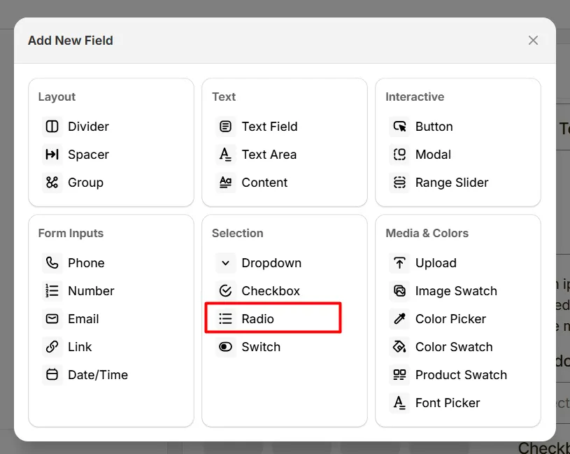
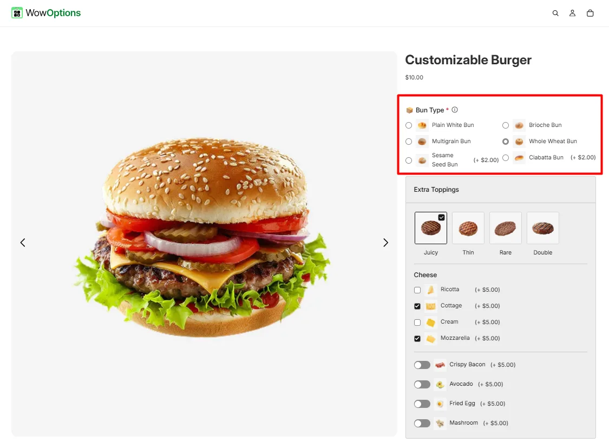
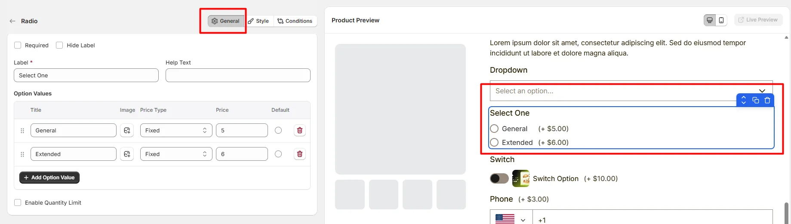
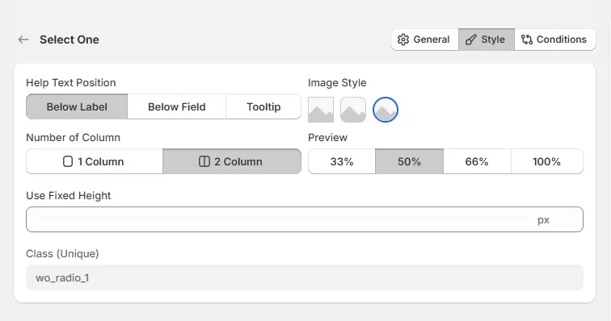

# Radio

The **Radio** option lets customers choose one option from several visible choices, such as color, package type, or configuration.

Here's an example of how the Radio Button appears on the frontend

## General Tab (Basic Settings)

This tab controls the core configuration of the Radio field, including the label, help text, selectable options, pricing behavior, and quantity limits.

### Required

Enable this option to make the radio selection mandatory. Customers must choose one option before they can add the product to the cart.

### Hide Label

Hide the field label from customers. Enable this when the purpose of the radio group is already clear or when you want a minimal layout.

### Label

The visible name shown to customers (for example: “Select Plan”, “Choose Size”, or “Pick a Package”). Keep the label short and descriptive so customers understand what they need to select.

### Help Text

Short instructional text shown to customers to guide their selection. For examples:

- “Select one option”
- “Choose your preferred package”
- “Pick the option that best fits your needs”

The display position of the help text can be controlled in the **Style Tab**.

### Option Values

Defines the list of selectable radio options. Each option includes the following settings:

- **Title:** The name displayed next to the radio option.
- **Image:** Optional image icon associated with the option.
- **Price Type:** Determines how the option affects the product price.
- **Price:** The amount added to the product price when the option is selected.
- **Default:** Sets the option as the default selected value when the product page loads.

Available price types include:

- **No Cost:** The option does not add any additional cost.
- **Fixed:** Adds a fixed amount to the product price.
- **Percentage:** Adds a percentage based on the product price.

Use **Add Option Value** to create additional radio options.

### Enable Quantity Limit

Allows you to limit the quantity associated with each radio option.

- **Min Quantity**: Sets the minimum quantity allowed for the selected option.
- **Max Quantity**: Sets the maximum quantity allowed for the selected option.

## Style Tab (Layout & Appearance)

This tab controls how the Radio field appears on the product page, including help text placement, layout columns, option image style, field width, and custom styling.

### Help Text Position

Controls where the help text appears relative to the field.

- **Below Label:** Help text appears under the field label.
- **Below Field:** Help text appears below the radio options.
- **Tooltip:** Help text appears inside an information icon, saving space in the layout.

### Number of Column

Controls how the radio options are arranged.

- **1 Column:** Displays options in a vertical list.
- **2 Column:** Displays options in two side-by-side columns.

### Field Width

Controls how wide the radio field appears within the options layout.

- **33%** – narrow column
- **50%** – half width
- **66%** – wide column
- **100%** – full width

### Image Style

Controls how option images appear next to the radio options.

- **Square Image:** Displays option images with square corners.
- **Rounded Image:** Displays option images with slightly rounded corners.
- **Circular Image:** Displays option images in a circular format.

### Use Fixed Height

Defines a fixed height for the radio option container. This helps maintain consistent layout when options contain images or long labels.

### Class (Unique)

A unique CSS class assigned to the radio field (example: `wo_radio_1`).

Use this if you want to:

- apply custom CSS styling
- target the field with custom scripts
- customize its appearance using theme code

## Conditions Tab

Use this tab to control the visibility of the Radio option. You can show or hide it only when specific custom options or Shopify variants are selected. To learn how to configure conditional logic, follow this guide.

## Get Support 👇

If you experience any issues while configuring the Radio option, reach out to the WowApps support team via the in-app chat or email <a href="mailto:support@wowapps.io">**support@wowapps.io**</a>. You can also reach the dedicated manager at <a href="mailto:nayeem@wowapps.io">**nayeem@wowapps.io**</a>.
