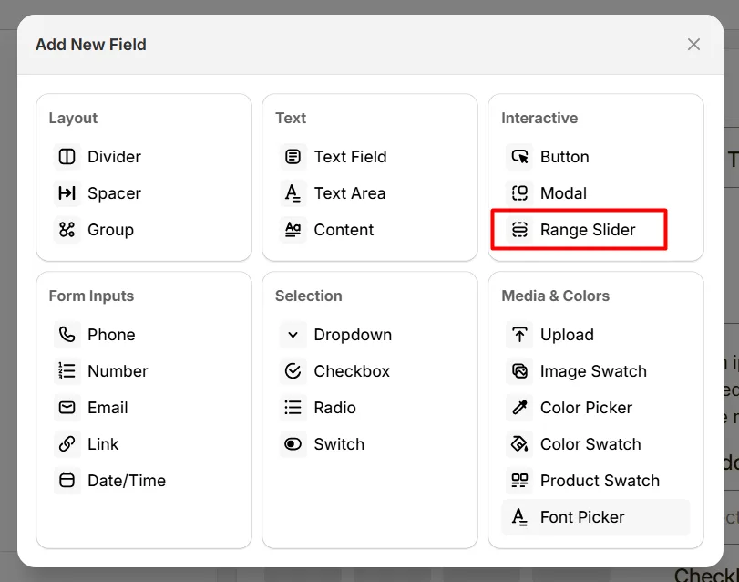
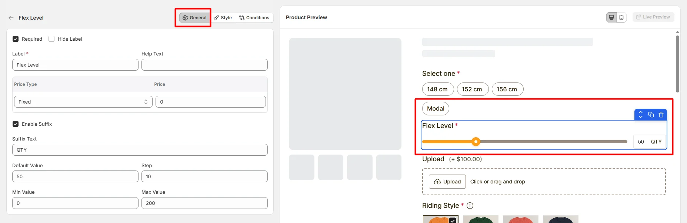
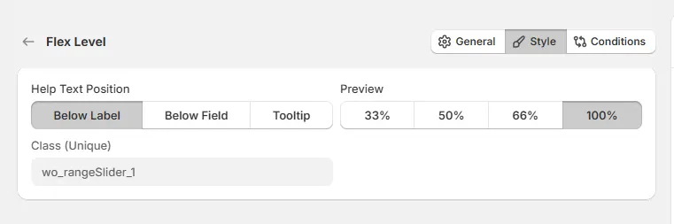

# Range Slider

The **Range Slider** option lets customers select a value within a range by sliding a control, such as choosing a quantity, size range, or measurement.

Here's an example of how the Range Slider appears on the frontend

## General Tab (Basic Settings)

This tab controls the core configuration of the Range Slider option, including the label, help text, pricing behavior, slider range, step value, and default value.

### Required

Enable this option to make the slider selection mandatory. Customers must choose a value before they can add the product to the cart.

### Hide Label

Hide the field label from customers. Enable this when the slider purpose is already clear or when you want a minimal layout.

### Label

The visible name shown to customers (for example: “Quantity”, “Length”, or “Customization Level”). Keep the label short and descriptive so customers understand what the slider controls.

### Help Text

Short instructional text shown to customers to guide their selection. The display position of the help text can be controlled in the Style Tab.

Examples:

* “Select the desired quantity”
* “Drag the slider to choose the size”
* “Choose a value between 1 and 100”

### Price Type

Defines how the selected slider value affects the product price.

* **No Cost:** The slider value does not add any additional cost.
* **Fixed:** Adds a fixed amount to the product price.
* **Percentage:** Adds a percentage based on the product price.

### Price

The amount added to the product price based on the selected **Price Type**. For example:

* Fixed price adjustment based on the selected value
* Percentage-based pricing adjustment

### Enable Suffix

Enable this option to display additional text next to the selected slider value. This helps clarify the meaning of the value displayed to customers.

In the Suffix Text field, defines the text displayed after the selected value. For example:

* Qty
* cm
* kg
* items

### Default Value

Sets the value that the slider starts with when the product page loads.

### Step

Defines the increment amount when the slider moves. For example:

* **1** – slider increases one unit at a time
* **5** – slider increases in steps of five

### Min Value

Sets the minimum value that customers can select.

### Max Value

Sets the maximum value that customers can select.

## Style Tab (Layout & Appearance)

This tab controls how the Range Slider appears on the product page, including help text placement, field width, and custom styling.

### Help Text Position

Controls where the help text appears relative to the field.

* **Below Label:** Help text appears under the field label.
* **Below Field:** Help text appears below the slider.
* **Tooltip:** Help text appears inside an information icon, saving space in the layout.

### Field Width

Controls how wide the slider field appears within the options layout.

* **33%** – narrow column
* **50%** – half width
* **66%** – wide column
* **100%** – full width (recommended for sliders)

### Class (Unique)

A unique CSS class assigned to the slider field (example: `wo_rangeSlider_1`).

Use this if you want to:

* apply custom CSS styling
* target the slider with custom scripts
* customize its appearance using theme code

## Conditions Tab

Use this tab to control the visibility of the Range Slider option. You can show or hide it only when specific custom options or Shopify variants are selected. To learn how to configure conditional logic, follow this guide.

## Get Support 👇

If you experience any issues while configuring the Range Slider option, reach out to the WowApps support team via the in-app chat or email [**support@wowapps.io**](mailto:support@wowapps.io). You can also reach the dedicated manager at [**nayeem@wowapps.io**](mailto:nayeem@wowapps.io).
