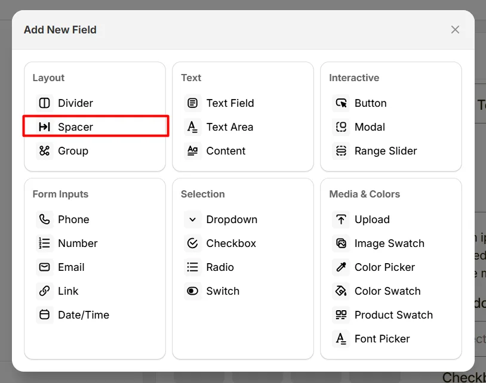
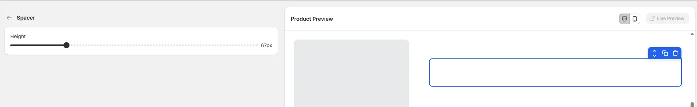

# Spacer

The Spacer option lets you add space between fields to improve layout and readability.

Unlike other fields, the Spacer does not display any fields to collect user input. Its purpose is purely to control spacing within options fields.

Here's an example of how the Spacer appears on the frontend

## Height

Controls the amount of empty vertical space inserted between option fields or sections. Use this to improve layout spacing and make groups of options easier for customers to read.

### Recommended Height Values

| Height    | Use Case                                          |
| --------- | ------------------------------------------------- |
| 10px–20px | Small spacing between closely related fields      |
| 25px–40px | Medium spacing between option sections            |
| 50px Plus | Large spacing for clear separation between groups |

For most product personalization forms, 20px is ideal. {/\* image here \*/}

## When to Use a Spacer

Use the Spacer field when:

* Fields appear too close together
* You want better visual separation
* The form feels crowded
* You want consistent spacing across sections

## Get Support 👇

If you experience any issues while configuring the Spacer option, reach out to the WowApps support team via the in-app chat or email [**support@wowapps.io**](mailto:support@wowapps.io). You can also reach the dedicated manager at [**nayeem@wowapps.io**](mailto:nayeem@wowapps.io).
