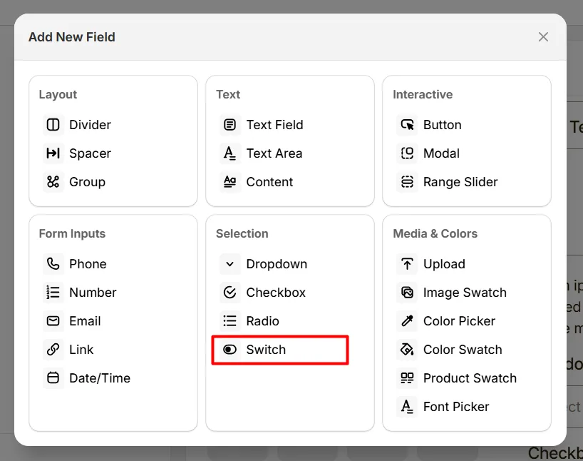
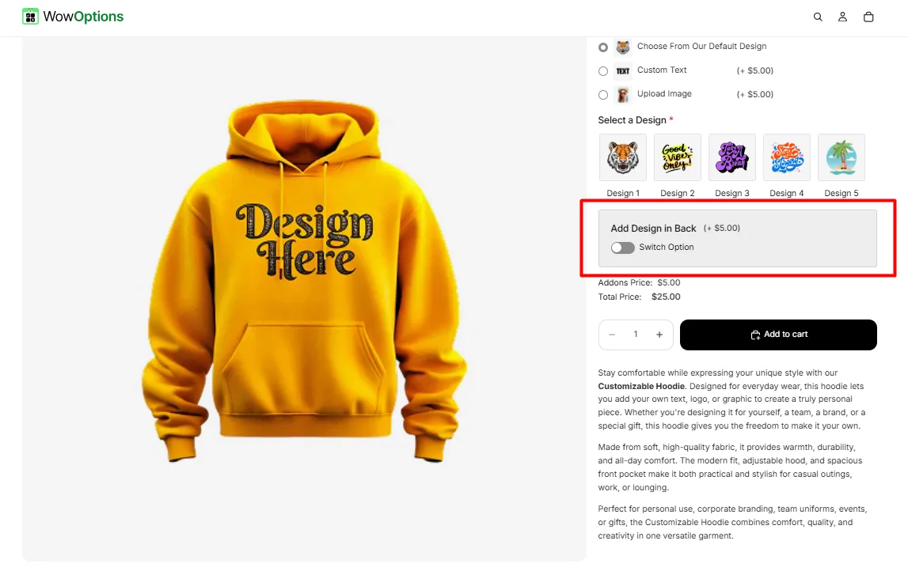
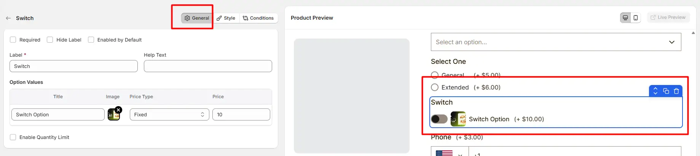
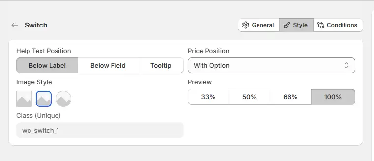

# Switch

The **Switch** option lets customers toggle a feature on or off, such as enabling gift wrapping or adding express delivery.

Here's an example of how the Switch appears on the frontend

## General Tab (Basic Settings)

This tab controls the main configuration of the Switch field, including the label, help text, toggle behavior, pricing, and quantity limits.

### Required

Enable this option to make the switch mandatory. Customers must enable the switch before they can add the product to the cart.

### Hide Label

Hide the field label from customers. This is useful when the purpose of the switch is already clear from the layout or surrounding content.

### Enabled by Default

When enabled, the switch will be turned on automatically when the product page loads. Customers can still toggle it off if they do not want the option.

### Label

The visible name shown to customers (for example: “Add Gift Wrap”, “Enable Premium Feature”, or “Include Installation”). Keep the label short and descriptive so customers clearly understand the option.

### Help Text

Short instructional text displayed to guide customers. For examples:

- Turn on to include this option
- Enable if you want this feature added
- Optional upgrade

The position of this help text can be controlled from the **Style Tab**.

### Option Values

Defines the configuration of the switch option.

- **Title:** The name associated with the switch option
- **Image:** Optional image icon displayed alongside the switch.
- **Price Type:** Determines how the option affects the product price.
- **Price:** The amount added to the product price when the switch is enabled.

Available price types include:

- **Fixed:** Adds a fixed amount to the product price.
- **Percentage:** Adds a percentage based on the product price.
- **No Cost:** The switch does not add any additional cost.

### Enable Quantity Limit

Allows you to restrict the quantity when the switch option is enabled.

- **Min Quantity**: Defines the minimum quantity required when the switch is active.
- **Max Quantity**: Defines the maximum quantity allowed when the switch is enabled.

## Style Tab (Layout & Appearance)

This tab controls how the Switch field appears on the product page, including help text placement, price position, option image style, field width, and custom styling.

### Help Text Position

Controls where the help text appears relative to the field.

- **Below Label:** Help text appears under the field label.
- **Below Field:** Help text appears below the switch control.
- **Tooltip:** Help text appears inside an information icon to save space.

### Price Position

Controls where the additional price appears when the switch is enabled.

- **With Title:** The price is displayed beside the switch label.
- **With Option:** The price appears next to the switch option.

### Field Width

Controls how wide the switch field appears in the options layout.

- **33%** — narrow column
- **50%** — half width
- **66%** — wider column
- **100%** — full width

### Image Style

Controls how the option image appears with the switch.

- **Square Image:** Displays the image with square corners.
- **Rounded Image:** Displays the image with rounded corners.
- **Circular Image:** Displays the image in a circular format.

### Class (Unique)

A unique CSS class assigned to this switch field (example: `wo_switch_1`). Use this class when you want to apply custom CSS styling or target the switch field with custom scripts.

## Conditions Tab

Use this tab to control the visibility of the Switch option. You can show or hide it only when specific custom options or Shopify variants are selected. To learn how to configure conditional logic, follow this guide.

## Get Support 👇

If you experience any issues while configuring the Switch option, reach out to the WowApps support team via the in-app chat or email <a href="mailto:support@wowapps.io">**support@wowapps.io**</a>. You can also reach the dedicated manager at <a href="mailto:nayeem@wowapps.io">**nayeem@wowapps.io**</a>.
