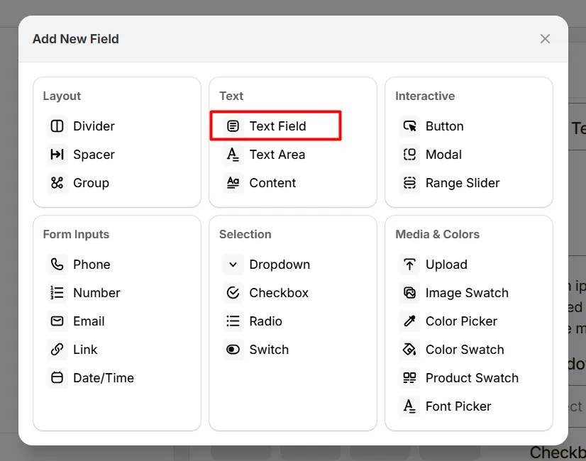
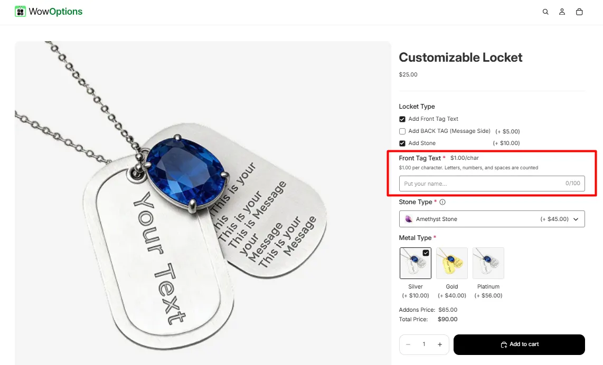
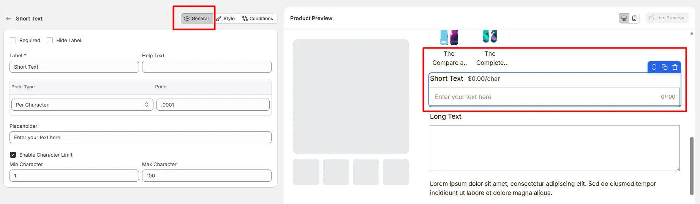
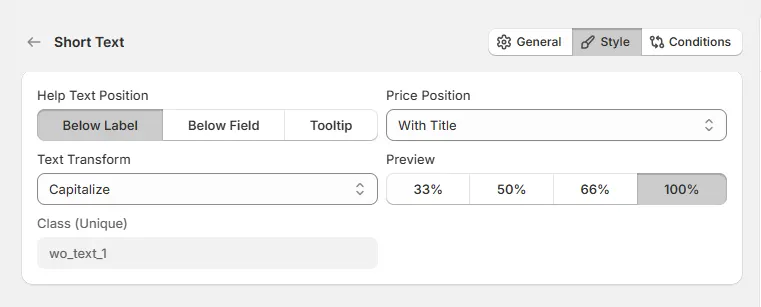

# Text Field

The **Text Field** option lets customers enter a short piece of text, such as a name, initials, or custom message for printing or engraving.

Here's an example of how the Text Field appears on the frontend

## General Tab (Basic Settings)

This tab controls the core configuration of the Text Field, including the label, help text, pricing behavior, placeholder text, and character limits.

### Required

Enable this option to make the field mandatory. Customers must enter text before they can add the product to the cart.

### Hide Label

Hide the field label from customers. Enable this when the field context is already clear or when you want a minimal layout.

### Label

The visible name shown to customers (for example: “Name”, “Initials”, or “Short Engraving”). Keep the label short and descriptive so customers understand what information is expected.

### Help Text

Short instructional text shown to customers to guide their input.

Examples:

* “Enter the name to print”
* “Maximum 20 characters”
* “Only letters allowed”

The display position of the help text can be controlled in the Style Tab.

### Price Type

Defines how this field affects the product price.

* **No Cost:** The field does not add any additional cost.
* **Fixed:** Adds a fixed amount to the product price.
* **Percentage:** Adds a percentage based on the product price.
* **Per Character:** Charges based on the number of characters entered.
* **Per Character (No Space):** Charges per character while ignoring spaces.
* **Per Word:** Charges based on the number of words entered.

### Price

The amount added to the product price based on the selected Price Type.

For example:

* Fixed price for personalization
* Price per engraved character
* Percentage-based customization fee

### Placeholder

Example text displayed inside the input box before the customer types. Use placeholders to guide the customer on what to enter.

Example: Enter your text here

### Enable Character Limit

Enable this option to restrict how many characters customers can enter.

* **Min Character:** Sets the minimum number of characters required before the form can be submitted.
* **Max Character:** Sets the maximum number of characters allowed in the field.

## Style Tab (Layout & Appearance)

This tab controls how the Text Field appears on the product page, including help text placement, price display position, text formatting behavior, field width, and custom styling.

### Help Text Position

Controls where the help text appears relative to the field.

* **Below Label:** Help text appears under the field label.
* **Below Field:** Help text appears below the input field.
* **Tooltip:** Help text appears inside an information icon, saving space in the layout.

### Price Position

Controls where the price adjustment label appears.

* **With Title:** The price appears next to the field label.
* **With Option:** The price appears near the input field.

### Text Transform

Automatically changes the format of the customer’s text input.

* **None:** No formatting changes.
* **Uppercase:** All text becomes uppercase.
* **Lowercase:** All text becomes lowercase.
* **Capitalize:** The first letter of each word becomes capitalized.

### Field Width

Controls how wide the field appears within the options layout.

* **33%** – narrow column
* **50%** – half width
* **66%** – wide column
* **100%** – full width (recommended for most inputs)

### Class (Unique)

A unique CSS class assigned to the field (example: `wo_text_1`).

Use this if you want to:

* apply custom CSS styling
* target the field with custom scripts
* customize its appearance using theme code

## Conditions Tab

Use this tab to control the visibility of the Text Field option. You can show or hide it only when specific custom options or Shopify variants are selected. To learn how to configure conditional logic, follow this guide.

## Get Support 👇

If you experience any issues while configuring the Text Field option, reach out to the WowApps support team via the in-app chat or email [**support@wowapps.io**](mailto:support@wowapps.io). You can also reach the dedicated manager at [**nayeem@wowapps.io**](mailto:nayeem@wowapps.io).
