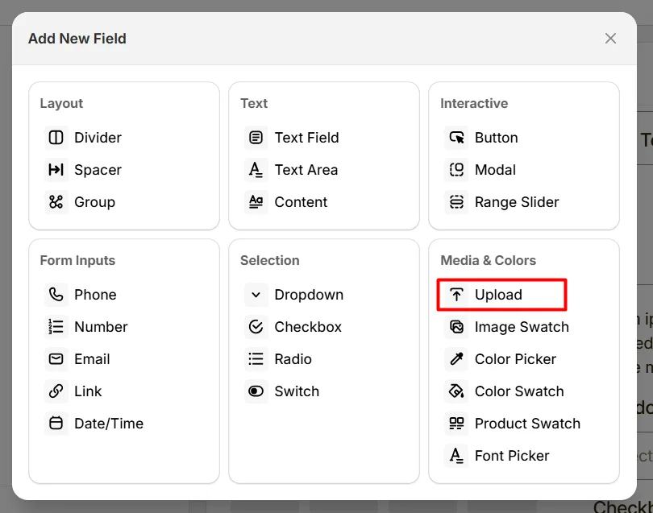
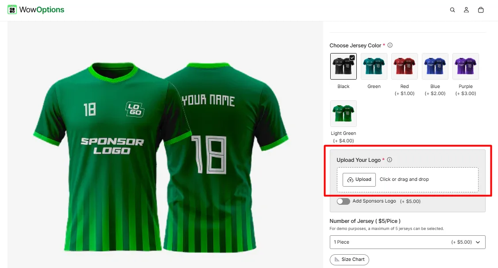
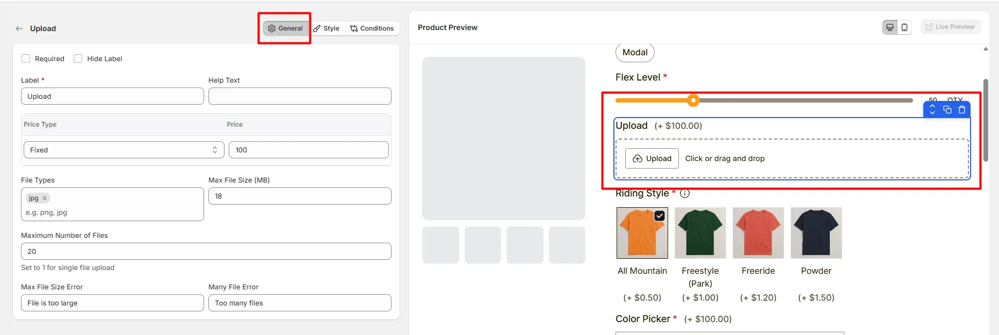
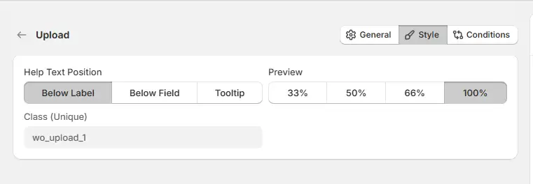

# Upload

The **Upload** option lets customers upload files or images, such as logos, photos, or design references.

Here's an example of how the Upload Field appears on the frontend

## General Tab (Basic Settings)

This tab controls the main configuration of the Upload field, including the label, help text, pricing behavior, allowed file types, file size limits, and the maximum number of files customers can upload.

### Required

Enable this option to make the file upload mandatory. Customers must upload at least one file before they can add the product to the cart.

### Hide Label

Hide the field label from customers. Use this when the upload purpose is already clear from surrounding instructions or layout.

### Label

The visible name shown to customers (for example: “Upload Image”, “Upload Logo”, or “Upload Design File”). Use a clear label so customers understand what type of file they need to upload.

### Help Text

Short instructional text displayed to guide customers when uploading files. The position of the help text can be adjusted from the **Style Tab**.

### Price Type

Determines whether uploading a file affects the product price.

Available options include:

* **Fixed** — adds a fixed amount when a file is uploaded.
* **Percentage** — adds a percentage of the product price.
* **No Cost** — uploading files does not change the product price.

### Price

Defines the additional cost applied when the upload option is used.

### File Types

Defines the file formats customers are allowed to upload. You can allow one or multiple formats depending on your use case. There are 19 file types supported in WowOptions.

* jpg
* png
* gif
* webp
* svg
* pdf
* doc / docx
* xls / xlsx
* txt / csv
* zip / rar
* mp3 / wav
* mp4 / webm / mov

Only files matching the allowed extensions will be accepted.

### Max File Size (MB)

Defines the maximum allowed file size for each uploaded file.

### Maximum Number of Files

Controls how many files a customer can upload.

**Note**: The allowed limits depend on your plan. Pro users can upload up to **15 files** with a maximum size of **10 MB per file**. Advanced users can upload up to **25 files** with a maximum size of **20 MB per file**.

### Max File Limit Error

Custom error message shown when a customer uploads a file that exceeds the allowed file size. For example: File is too large

### Many File Error

Custom error message displayed when the number of uploaded files exceeds the allowed limit. For example: Too many files

## Style Tab (Layout & Appearance)

This tab controls how the Upload field appears on the product page, including help text placement, field width, and custom styling.

### Help Text Position

Controls where the help text appears relative to the upload field.

* **Below Label:** help text appears under the field label.
* **Below Field:** help text appears below the upload area.
* **Tooltip:** help text appears inside an information icon.

### Field Width

Controls how wide the upload field appears within the options layout.

* **33%** — narrow column
* **50%** — half width
* **66%** — wider column
* **100%** — full width

### Class (Unique)

A unique CSS class assigned to the upload field (example: `wo_upload_1`).

This can be used to apply custom CSS styling or to target the upload field using scripts.

## Conditions Tab

Use this tab to control the visibility of the Upload option. You can show or hide it only when specific custom options or Shopify variants are selected. To learn how to configure conditional logic, follow this guide.

## Get Support 👇

If you experience any issues while configuring the Upload option, reach out to the WowApps support team via the in-app chat or email [**support@wowapps.io**](mailto:support@wowapps.io). You can also reach the dedicated manager at [**nayeem@wowapps.io**](mailto:nayeem@wowapps.io).
