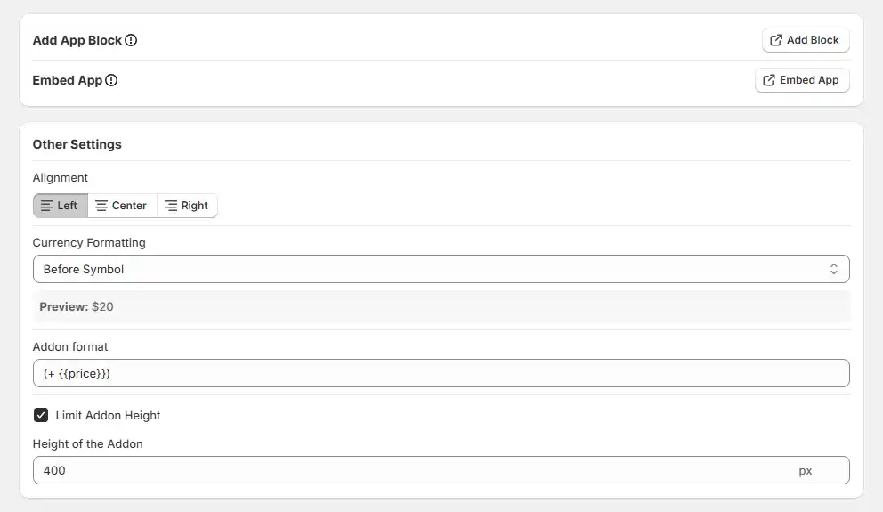
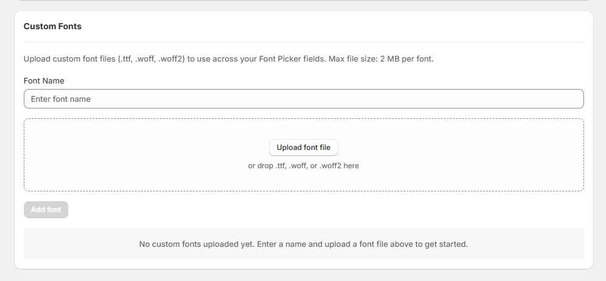

# Settings

The Settings page allows you to control the global behavior and appearance of WowOptions across your Shopify store.

## App Status & Setup

At the top of the Settings page, you will see the App Status, which indicates whether the app is visible on your storefront.

* **Enabled** — The app is active, and product options are visible on your storefront
* **Disabled** — The app is not visible on your storefront

If the app is disabled, you can enable it by completing the following steps:

1. Click Add Block and add the WowOptions block to your product template
2. Click Embed App and enable the app embed in your theme
3. Save your theme

Both steps are required to ensure the app works properly.

## Other Settings

These settings control the appearance and formatting of your option fields.

### Alignment

Controls how the option fields are aligned on the product page.

* **Left** — Aligns fields to the left
* **Center** — Centers the fields
* **Right** — Aligns fields to the right

### Currency Formatting

Defines how prices are displayed alongside option fields. Available options are:

* **None** — No currency symbol or code
* **Before Symbol** — Symbol appears before the price (e.g., $20)
* **After Symbol** — Symbol appears after the price (e.g., 20$)
* **Before Code** — Currency code before the price (e.g., USD 20)
* **After Code** — Currency code after the price (e.g., 20 USD)

A preview is shown below the field to help you understand how it will appear.

### Addon Format

Controls how additional prices are displayed next to options.

Example: (+ `{{price}}`)

You can customize this format to match your store's style

### Limit Addon Height

Restricts the height of the options container. Enable this to prevent long option lists from expanding too much. It is especially useful for maintaining a clean layout. Defines the maximum height of the options area in pixels.

Example: 400 px

When exceeded, a scroll bar will appear

## Custom Fonts

You can also upload and use custom fonts from the Custom Fonts section in Settings. Supported formats include .ttf, .woff, and .woff2. Simply assign a name, upload your font, and you're ready to go.

